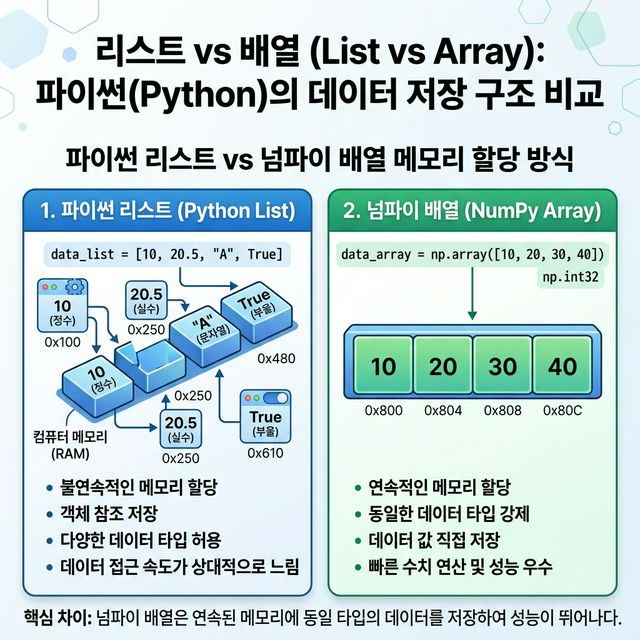
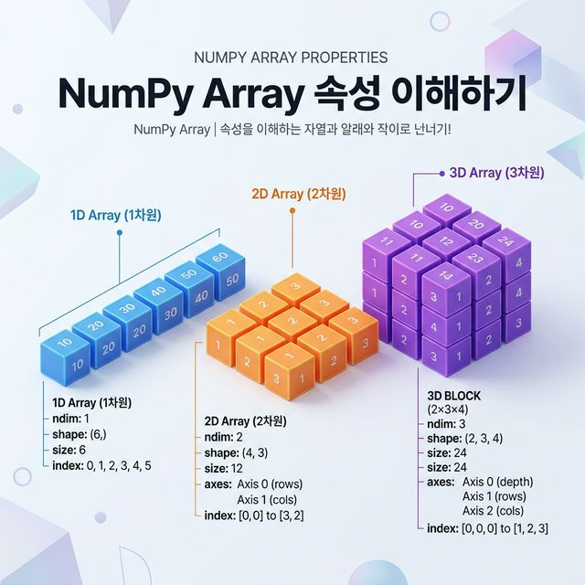
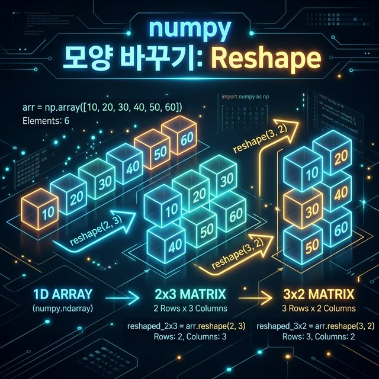

# Week 03 Note: NumPy 기초

## 1. 이 주제의 목적

3주차의 목표는 `NumPy` 배열을 단순히 만들어 보는 데서 끝나지 않고, 배열이라는 데이터 구조를 어떻게 읽고, 어떻게 바꾸고, 왜 계산에 유리한지를 이해하는 것입니다.

이 주차를 제대로 이해하면 아래 흐름이 자연스럽게 잡혀야 합니다.

1. 데이터를 배열로 만든다.
2. 배열의 구조를 확인한다.
3. 원하는 위치를 선택한다.
4. 배열의 모양을 바꾼다.
5. 전체 특성을 계산한다.
6. 1차원 배열을 벡터처럼 해석한다.

즉, 3주차는 이후 모든 계산 실습의 바닥을 만드는 주차입니다.

## 2. 왜 중요한가

NumPy는 파이썬 수치 계산의 기본 도구입니다.

- 많은 숫자를 한 번에 계산할 수 있습니다.
- 벡터와 행렬 같은 구조를 자연스럽게 표현할 수 있습니다.
- 이후 배우는 내적, Pandas, 머신러닝 실습과 계속 연결됩니다.

초심자는 종종 리스트와 NumPy 배열을 비슷하게 보지만, 실제 차이는 큽니다. 리스트는 일반 자료구조이고, NumPy 배열은 계산을 위한 자료구조입니다.

## 3. 선수 개념

이번 주차를 보기 전에 아래 정도는 알고 있으면 좋습니다.

- 파이썬 리스트와 딕셔너리의 기본
- 인덱스 개념
- 숫자형 데이터와 문자열 구분

연결 포인트
- 실습 코드: [../../week03_NumPy.ipynb](../../week03_NumPy.ipynb)
- 다음 주차 연결: [../week04/Week04_Note.md](../week04/Week04_Note.md)

## 4. 핵심 개념과 용어 해설

### 4-1. 배열(array)

배열은 여러 값을 한 번에 담고 계산하기 위한 구조입니다.



```python
import numpy as np

arr = np.array([1, 2, 3, 4, 5])
```

이 코드는 무엇을 의미하는가
- 파이썬 리스트를 NumPy 배열로 바꿉니다.

왜 필요한가
- 이후 NumPy의 집계, 벡터 연산, 구조 변환은 배열을 기준으로 하기 때문입니다.

시험이나 설명에서 어떻게 말할 수 있는가
- "`np.array()`는 파이썬 시퀀스를 NumPy의 계산용 배열 구조로 변환하는 기본 함수"라고 설명하면 됩니다.

### 4-2. 배열 생성 함수

3주차에서는 직접 입력뿐 아니라, 규칙적인 배열을 빠르게 만드는 방식도 중요합니다.

```python
zeros_arr = np.zeros((2, 3))
ones_arr = np.ones((2, 3))
empty_arr = np.empty((2, 3))
full_arr = np.full((2, 3), 7)
range_arr = np.arange(1, 7)
```

각 함수에서 떠올려야 할 것
- `zeros`: 0으로 채운 배열
- `ones`: 1로 채운 배열
- `empty`: 초기화되지 않은 메모리 공간
- `full`: 지정 값으로 채운 배열
- `arange`: 규칙적인 수열 생성

주의할 점
- `np.empty()`는 0 배열이 아닙니다.
- `np.arange(1, 7)`은 `1`부터 `6`까지입니다.

### 4-3. 배열의 기본 속성

배열을 만들고 나면 가장 먼저 구조를 봐야 합니다.



```python
matrix = range_arr.reshape(2, 3)

print(arr.shape)
print(arr.ndim)
print(arr.size)
print(arr.dtype)
print(matrix.T)
```

핵심 속성
- `shape`: 배열 모양
- `ndim`: 차원 수
- `size`: 전체 원소 개수
- `dtype`: 자료형

왜 중요한가
- 배열 연산 오류의 상당수는 값이 아니라 구조를 잘못 이해해서 생깁니다.

### 4-4. 인덱싱과 슬라이싱

인덱싱은 한 위치를 읽는 것이고, 슬라이싱은 구간을 읽는 것입니다.

```python
print(arr[0])
print(arr[-1])
print(arr[1:4])
print(arr[:3])
print(arr[2:])
print(arr[::2])
```

2차원 배열에서는 행과 열을 함께 봐야 합니다.

```python
print(matrix[0, 0])
print(matrix[1, 2])
print(matrix[0, :])
print(matrix[:, 1])
print(matrix[:, :2])
```

왜 필요한가
- 실제 데이터는 전체보다 일부만 꺼내는 일이 훨씬 많기 때문입니다.

자주 하는 실수
- 슬라이싱 끝 인덱스가 포함된다고 착각함
- `matrix[row, col]` 순서를 헷갈림

### 4-5. `reshape`

`reshape`는 원소 수를 유지한 채 배열 구조만 바꾸는 연산입니다.



```python
reshaped_3x2 = range_arr.reshape(3, 2)
reshaped_1x6 = range_arr.reshape(1, 6)
```

왜 필요한가
- 같은 데이터라도 1차원 벡터, 2차원 행렬, 표 구조처럼 다르게 해석해야 하는 상황이 많기 때문입니다.

핵심 규칙
- 원소 수가 같아야 합니다.
- 예를 들어 원소가 6개면 `(2, 3)`, `(3, 2)`, `(1, 6)`은 가능하지만 `(4, 2)`는 불가능합니다.

### 4-6. 난수와 집계 함수

실습에서는 랜덤 데이터와 요약 통계도 함께 봅니다.

```python
np.random.seed(42)
uniform_arr = np.random.uniform(0, 1, 5)
normal_arr = np.random.normal(loc=50, scale=10, size=5)

print(np.sum(arr))
print(np.mean(arr))
print(np.max(arr))
print(np.min(arr))
print(np.std(arr))
```

핵심 포인트
- `uniform`: 구간 내에서 비교적 고르게 분포
- `normal`: 평균 주변에 모이는 정규분포
- `sum`, `mean`, `max`, `min`, `std`: 배열 전체 특성 요약

왜 필요한가
- 데이터 분석은 보통 전체 데이터를 한눈에 요약하는 것부터 시작하기 때문입니다.

### 4-7. 메모리와 속도

3주차는 NumPy가 왜 실용적인지도 함께 보여 줍니다.

```python
import sys
import time
```

리스트와 배열은 큰 데이터에서 메모리 효율과 연산 속도 차이가 날 수 있습니다.

왜 중요한가
- NumPy는 단순히 문법이 예뻐서 쓰는 것이 아니라, 실제 계산 효율이 좋기 때문입니다.

### 4-8. 벡터와 고급 연산

1차원 배열은 벡터처럼 볼 수 있습니다.

```python
vector_a = np.array([1, 2, 3])
vector_b = np.array([4, 5, 6])

print(vector_a + vector_b)
print(vector_b - vector_a)
print(3 * vector_a)
print(np.dot(vector_a, vector_b))
print(np.linalg.norm(vector_a))
```

각 함수에서 떠올려야 할 것
- `+`, `-`: 벡터 덧셈과 뺄셈
- 스칼라 곱: 모든 원소에 같은 수를 곱함
- `dot`: 내적
- `norm`: 벡터 크기

왜 중요한가
- 이 부분이 4주차 내적과 직접 연결되기 때문입니다.

## 5. 실습 파일과 핵심 흐름

관련 실습
- [../../week03_NumPy.ipynb](../../week03_NumPy.ipynb)

추천 실습 순서
1. `np.array()`와 기본 생성 함수로 배열 만들기
2. `shape`, `ndim`, `size`, `dtype` 확인하기
3. 1차원, 2차원 인덱싱과 슬라이싱 연습하기
4. `reshape`로 구조 바꾸기
5. 난수와 집계 함수 실행하기
6. `dot`, `norm`으로 벡터 관점 연결하기

실습에서 꼭 봐야 할 질문
- 지금 이 배열은 몇 차원인가?
- 지금 이 연산은 원소별 연산인가, 전체 집계인가?
- 구조가 바뀌어도 원소 수는 유지되는가?

## 6. 자주 하는 실수

### 실수 1. 리스트와 배열을 완전히 같은 것으로 생각함

올바른 방향
- 둘 다 값을 담지만, NumPy 배열은 계산 중심 구조라는 점을 기억해야 합니다.

### 실수 2. 배열 구조를 보지 않고 연산함

올바른 방향
- `shape`, `ndim`, `size`, `dtype`를 먼저 확인해야 합니다.

### 실수 3. `np.empty()`를 0 배열로 오해함

올바른 방향
- `empty`는 초기화되지 않은 공간입니다.

### 실수 4. `reshape`에서 원소 수를 무시함

올바른 방향
- 총 원소 수가 보존되는지 먼저 계산해야 합니다.

### 실수 5. 내적과 원소별 곱을 혼동함

올바른 방향
- 원소별 곱은 배열 결과, 내적은 곱해서 더한 하나의 값입니다.

## 7. 시험 대비 포인트

시험 직전에는 아래를 설명할 수 있어야 합니다.

- NumPy 배열이 왜 필요한가
- `shape`, `ndim`, `size`, `dtype` 차이
- 인덱싱과 슬라이싱 차이
- `reshape`가 왜 필요한가
- `sum`, `mean`, `std`, `dot`, `norm`의 의미
- 1차원 배열이 왜 벡터처럼 해석되는가

서술형 답안 구조 예시

> NumPy는 수치 계산에 적합한 배열 기반 라이브러리이다. 배열은 `np.array()`나 `zeros`, `ones`, `arange` 같은 함수로 생성할 수 있으며, 생성 후에는 `shape`, `ndim`, `size`, `dtype`를 통해 구조를 확인한다. 또한 인덱싱과 슬라이싱으로 필요한 부분을 선택하고, `reshape`로 배열 모양을 바꿀 수 있다. 집계 함수인 `sum`, `mean`, `std`와 벡터 연산인 `dot`, `norm`은 이후 선형대수와 머신러닝 학습의 기초가 된다.

## 8. 기존 문서와 연결 포인트

- 실습 코드: [../../week03_NumPy.ipynb](../../week03_NumPy.ipynb)
- 보충 문서: [notes/01_array_creation_and_properties.md](./notes/01_array_creation_and_properties.md)
- 보충 문서: [notes/02_indexing_slicing_and_reshape.md](./notes/02_indexing_slicing_and_reshape.md)
- 보충 문서: [notes/03_random_stats_and_performance.md](./notes/03_random_stats_and_performance.md)
- 보충 문서: [notes/04_vectors_and_advanced_ops.md](./notes/04_vectors_and_advanced_ops.md)
- 다음 주차: [../week04/Week04_Note.md](../week04/Week04_Note.md)

## 9. 빠른 요약

- 3주차는 NumPy 배열을 제대로 읽고 다루는 주차입니다.
- 핵심은 배열 생성보다 구조 이해입니다.
- `shape`, 인덱싱, 슬라이싱, `reshape`가 가장 중요합니다.
- `sum`, `mean`, `std`, `dot`, `norm`은 이후 계산 주제로 계속 이어집니다.
