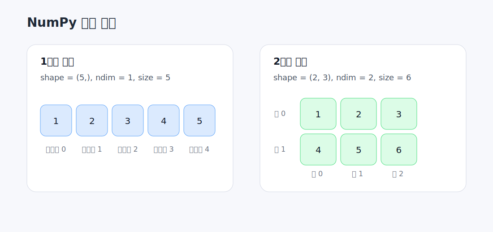

# 01. 배열 생성과 속성

이 문서는 3주차 실습 코드 중 배열 생성과 배열 속성 확인 부분을 정리합니다.

연결 실습
- [../week03_NumPy.ipynb](../week03_NumPy.ipynb)

## 1. `np.array()`로 배열 만들기

파이썬 리스트를 NumPy 배열로 바꾸는 가장 기본적인 방법입니다.

```python
import numpy as np

arr = np.array([1, 2, 3, 4, 5])

print("arr =", arr)
print("type(arr) =", type(arr))
```

## 2. 기본 배열 생성 메서드

자주 쓰는 생성 함수
- `np.zeros(shape)` : 0으로 채운 배열
- `np.ones(shape)` : 1로 채운 배열
- `np.empty(shape)` : 초기화되지 않은 배열
- `np.full(shape, value)` : 지정한 값으로 채운 배열
- `np.arange(start, stop)` : 일정 간격의 정수 배열

```python
zeros_arr = np.zeros((2, 3))
ones_arr = np.ones((2, 3))
empty_arr = np.empty((2, 3))
full_arr = np.full((2, 3), 7)
range_arr = np.arange(1, 7)
```

주의할 점
- `np.empty()`는 0으로 채워지지 않습니다.
- `np.arange(1, 7)`은 `1, 2, 3, 4, 5, 6`을 만듭니다.

## 3. 배열의 기본 속성

배열을 만들었으면 먼저 구조를 확인해야 합니다.



핵심 속성
- `shape` : 배열의 모양
- `ndim` : 배열의 차원 수
- `size` : 전체 원소 개수
- `dtype` : 데이터 타입

```python
matrix = range_arr.reshape(2, 3)

print(arr.shape)
print(arr.ndim)
print(arr.size)
print(arr.dtype)

print(matrix.shape)
print(matrix.ndim)
print(matrix.size)
print(matrix.dtype)
print(matrix.T)
```

학습 포인트
- `arr.shape`는 `(5,)`
- `matrix.shape`는 `(2, 3)`
- `matrix.T`는 전치 행렬입니다.
