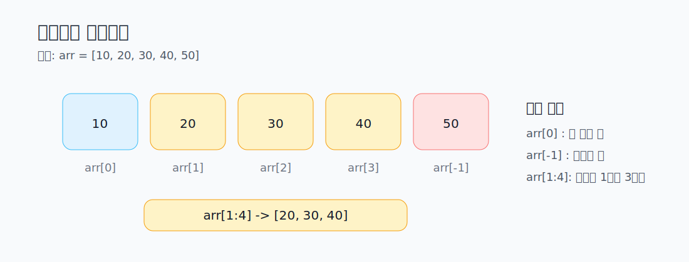
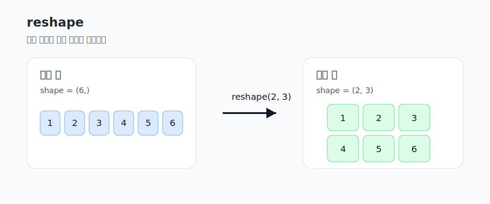

# 02. 인덱싱, 슬라이싱, reshape

이 문서는 1차원/2차원 배열 선택과 배열 모양 변경을 정리합니다.

연결 실습
- [../../../../week03_NumPy.ipynb](../../../../week03_NumPy.ipynb)

## 1. 1차원 배열 인덱싱과 슬라이싱



```python
print(arr[0])
print(arr[-1])
print(arr[1:4])
print(arr[:3])
print(arr[2:])
print(arr[::2])
```

슬라이싱 규칙
- `arr[a:b]` : 인덱스 `a`부터 `b-1`까지
- `arr[:b]` : 처음부터 `b-1`까지
- `arr[a:]` : 인덱스 `a`부터 끝까지
- `arr[::2]` : 2칸씩 건너뛰기

## 2. 2차원 배열 인덱싱과 슬라이싱

```python
print(matrix[0, 0])
print(matrix[1, 2])
print(matrix[0, :])
print(matrix[:, 1])
print(matrix[:, :2])
```

핵심 해석
- `matrix[0, :]` : 첫 번째 행 전체
- `matrix[:, 1]` : 두 번째 열 전체
- `matrix[:, :2]` : 모든 행의 앞 2개 열

## 3. reshape

배열의 원소 수를 유지한 채 구조만 바꿉니다.



```python
reshaped_3x2 = range_arr.reshape(3, 2)
reshaped_1x6 = range_arr.reshape(1, 6)
```

학습 포인트
- 원소 수가 같아야 `reshape`가 가능합니다.
- `range_arr`의 원소 수는 6개이므로 `2 x 3`, `3 x 2`, `1 x 6`은 가능합니다.
