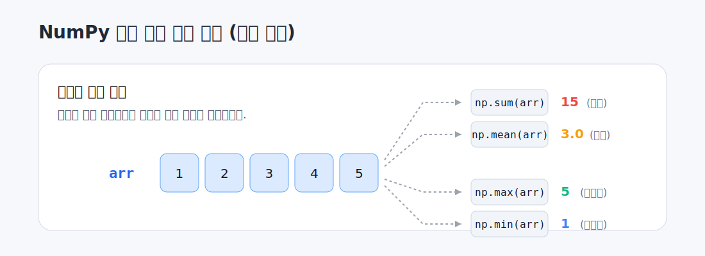

# 03. 난수, 집계, 메모리, 속도 비교

이 문서는 난수 생성, 집계 함수, 메모리 비교, 속도 비교를 정리합니다.

연결 실습
- [../week03_NumPy.ipynb](../week03_NumPy.ipynb)

## 1. 균등분포 난수

```python
np.random.seed(42)
uniform_arr = np.random.uniform(0, 1, 5)
```

`uniform`은 지정한 구간에서 비교적 고르게 값이 나옵니다.

## 2. 정규분포 난수

```python
np.random.seed(42)
normal_arr = np.random.normal(loc=50, scale=10, size=5)
normal_arr_large = np.random.normal(loc=50, scale=10, size=1000)
```

핵심 포인트
- `loc` : 평균
- `scale` : 표준편차
- 정규분포는 평균 근처에 값이 많이 모입니다.

## 3. 집계 함수



```python
print(np.sum(arr))
print(np.mean(arr))
print(np.max(arr))
print(np.min(arr))

print(np.sum(matrix, axis=1))
print(np.sum(matrix, axis=0))
print(np.mean(normal_arr))
```

## 4. 메모리 비교

```python
import sys

list_data = [1, 2, 3, 4, 5]
array_data = np.array([1, 2, 3, 4, 5])

print("List 메모리 크기:", sys.getsizeof(list_data) * len(list_data))
print("NumPy 배열 메모리 크기:", array_data.nbytes)
```

## 5. 연산 속도 비교

```python
import time

size = 10**6

list1 = list(range(size))
list2 = list(range(size))

start = time.time()
result_list = [x + y for x, y in zip(list1, list2)]
end = time.time()
print("리스트 연산 시간:", end - start)

arr1 = np.array(list1)
arr2 = np.array(list2)

start = time.time()
result_array = arr1 + arr2
end = time.time()
print("NumPy 연산 시간:", end - start)
```

정리
- NumPy는 메모리 사용이 더 효율적일 수 있습니다.
- 큰 데이터에서는 NumPy 연산이 리스트보다 빠른 경우가 많습니다.
