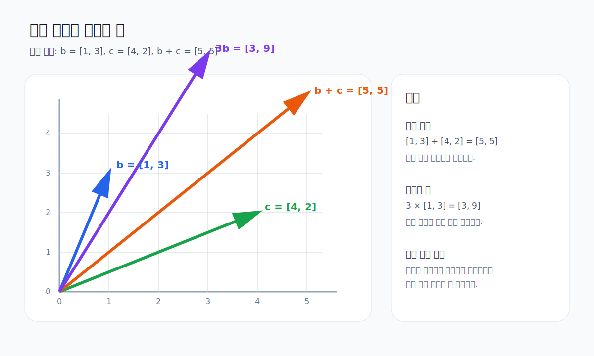
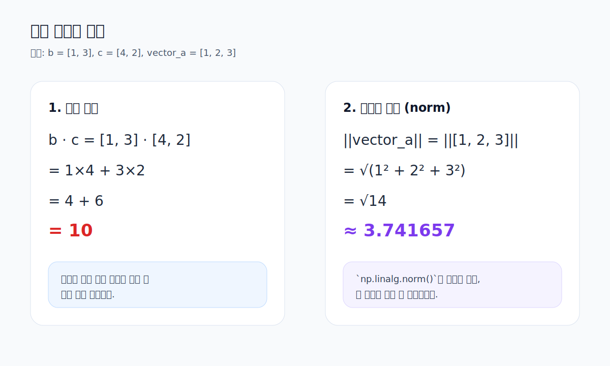

# 04. 벡터와 고급 연산

이 문서는 NumPy 배열을 벡터처럼 다루는 방법과 고급 연산을 정리합니다.

연결 실습
- [../week03_NumPy.ipynb](../week03_NumPy.ipynb)

## 1. 고급 연산

```python
advanced_arr = np.array([1, 2, 3, 4, 5])

print(np.mean(advanced_arr))
print(np.sum(advanced_arr))
print(np.std(advanced_arr))
print(np.dot(advanced_arr, advanced_arr))
```

핵심 함수
- `mean` : 평균
- `sum` : 합계
- `std` : 표준편차
- `dot` : 내적

## 2. 벡터란?

NumPy의 1차원 배열은 벡터처럼 사용할 수 있습니다.



예를 들어 다음 두 배열을 벡터로 볼 수 있습니다.

```python
vector_a = np.array([1, 2, 3])
vector_b = np.array([4, 5, 6])
```

## 3. `b.dot(c)`로 벡터 내적 이해하기

```python
b = np.array([1, 3])
c = np.array([4, 2])

print(b.dot(c))
```



설명
- `b.dot(c)`는 벡터 내적입니다.
- 계산은 `1*4 + 3*2` 입니다.
- 결과는 `10`입니다.

## 4. 벡터 덧셈과 뺄셈

```python
print(vector_a + vector_b)
print(vector_b - vector_a)
```

각 위치의 원소끼리 계산됩니다.

학습 포인트
- 벡터 덧셈은 좌표를 더하는 것과 같습니다.
- 벡터 뺄셈은 각 원소의 차이를 구하는 것과 같습니다.

## 5. 스칼라 곱

```python
print(3 * vector_a)
```

벡터의 모든 원소에 같은 수를 곱합니다.

학습 포인트
- 스칼라 곱은 벡터의 방향은 유지하고 크기를 바꾸는 연산으로 볼 수 있습니다.

## 6. 벡터 내적

```python
print(np.dot(vector_a, vector_b))
```

`[1, 2, 3] · [4, 5, 6]`
= `1*4 + 2*5 + 3*6`
= `32`

## 7. 벡터의 크기

```python
print(np.linalg.norm(vector_a))
```

`np.linalg.norm()`은 벡터의 길이 또는 크기를 구할 때 사용합니다.

학습 메모
- 벡터는 머신러닝과 선형대수의 기본 단위입니다.
- `dot`과 `norm`은 이후 유사도, 거리, 최적화 개념으로 계속 연결됩니다.
- 시각 자료를 먼저 보고 나서 코드를 실행하면 벡터 연산의 의미를 더 쉽게 연결할 수 있습니다.
