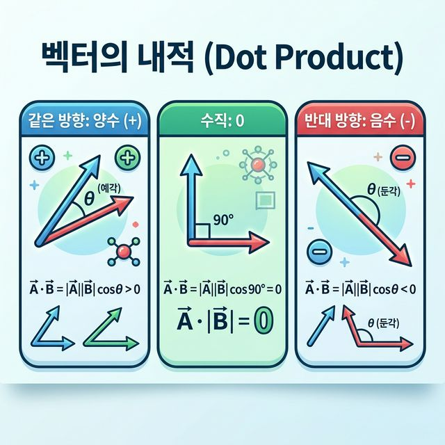

# Week 04 Note: 벡터와 내적

## 1. 이 주제의 목적

4주차의 목표는 벡터 내적을 단순 계산식이 아니라, 두 벡터의 관계를 읽는 도구로 이해하는 것입니다.

처음에는 내적이 그저 "곱해서 더하는 계산"처럼 보일 수 있습니다. 하지만 실제 핵심은 계산 결과의 의미입니다.

- 두 벡터가 얼마나 같은 방향을 보는가
- 서로 관련이 있는가
- 협력하는가, 무관한가, 반대인가

즉, 4주차는 수학식 암기보다 해석 능력이 중요한 주차입니다.

## 2. 왜 중요한가

내적은 선형대수와 머신러닝에서 매우 자주 등장합니다.

- 유사도 계산
- 방향성 해석
- 특징 벡터 비교
- 신호와 데이터 관계 분석

이 주차를 이해하면 이후의 수학적 개념이 훨씬 덜 추상적으로 보입니다.

## 3. 선수 개념

이번 주차를 보기 전에 아래는 익숙해야 합니다.

- NumPy 1차원 배열 생성
- 원소별 곱과 합
- 벡터를 좌표 묶음으로 보는 감각

연결 포인트
- 이전 주차: [../week03/Week03_Note.md](../week03/Week03_Note.md)
- 실습 코드: [../../week04_Vector_DotProduct.ipynb](../../week04_Vector_DotProduct.ipynb)

## 4. 핵심 개념과 용어 해설

### 4-1. 벡터

벡터는 여러 수를 순서 있게 모은 것으로 볼 수 있습니다.

```python
a = np.array([1, 2, 3])
b = np.array([4, 5, 6])
```

벡터를 보면 떠올려야 하는 것
- 좌표 묶음
- 방향과 크기를 가진 대상
- 덧셈, 뺄셈, 스칼라 곱, 내적이 가능한 구조

### 4-2. `axis`와 배열 감각

4주차에서도 `axis` 감각은 중요합니다. 내적을 잘 이해하려면 배열을 행과 열 관점에서 읽는 능력이 필요합니다.

```python
ops_matrix = np.array([[1, 2, 3], [4, 5, 6]])

print(np.sum(ops_matrix, axis=0))
print(np.sum(ops_matrix, axis=1))
```

핵심
- `axis=0`: 열 기준
- `axis=1`: 행 기준

> **참고 시각 자료: NumPy Axis 방향성 이해**
> 

왜 필요한가
- 벡터와 행렬 계산은 데이터를 어떤 방향으로 보는지에 따라 해석이 달라지기 때문입니다.

### 4-3. 내적(dot product)

내적은 같은 위치 원소끼리 곱한 뒤 모두 더하는 연산입니다.

```python
b = np.array([1, 3])
c = np.array([4, 2])

print(b.dot(c))
```

손계산

`[1, 3] · [4, 2]`
`= 1*4 + 3*2`
`= 10`

이 계산이 의미하는 것
- 단순 합계가 아니라, 두 벡터가 얼마나 같은 방향 성분을 가지는지 보여 줍니다.

### 4-4. 내적 결과의 부호

내적 해석에서 가장 중요한 부분입니다.



#### 같은 방향

```python
same_a = np.array([1, 2])
same_b = np.array([2, 4])
print(np.dot(same_a, same_b))
```

해석
- 결과는 양수
- 같은 방향 성분이 큼

#### 수직

```python
perp_a = np.array([1, 0])
perp_b = np.array([0, 2])
print(np.dot(perp_a, perp_b))
```

해석
- 결과는 0
- 서로 기여하지 않는 방향

#### 반대 방향

```python
opp_a = np.array([1, 2])
opp_b = np.array([-2, -4])
print(np.dot(opp_a, opp_b))
```

해석
- 결과는 음수
- 반대 방향 성분이 큼

시험장에서 바로 떠올릴 문장
- 양수: 같은 방향
- 0: 수직 또는 관련 없음
- 음수: 반대 방향

### 4-5. 사람 비유로 보는 내적

수식만 보면 내적은 딱딱하게 느껴질 수 있습니다. 사람 비유로 보면 더 쉽게 이해됩니다.

- 두 사람이 같은 방향으로 밀면 큰 양수
- 서로 다른 방향으로 독립적으로 움직이면 0
- 서로 반대로 밀면 음수

왜 이 비유가 중요한가
- 내적은 나중에 문장 임베딩, 추천 시스템, 특징 벡터 비교에도 등장하기 때문입니다.

### 4-6. NumPy에서 내적 계산하는 방법

```python
a = np.array([1, 2, 3])
d = np.array([4, 5, 6])

print(a.dot(d))
print(np.dot(a, d))
print(a @ d)
```

핵심
- `.dot()`
- `np.dot()`
- `@`

세 방식 모두 같은 내적 개념을 계산합니다.

### 4-7. `norm`

```python
print(np.linalg.norm(a))
```

`norm`은 벡터의 길이 또는 크기입니다.

왜 내적과 함께 보나
- 내적은 관계를, `norm`은 벡터 자체의 크기를 보여 주기 때문입니다.

## 5. 실습 파일과 핵심 흐름

관련 실습
- [../../week04_Vector_DotProduct.ipynb](../../week04_Vector_DotProduct.ipynb)

추천 실습 순서
1. 배열 연산과 `axis` 확인
2. `b.dot(c)` 손계산
3. 양수, 0, 음수 사례 비교
4. 사람 비유로 의미 연결
5. `.dot()`, `np.dot()`, `@`, `norm` 실습

실습에서 계속 스스로 물어볼 질문
- 지금 계산은 무엇을 구하는가?
- 이 결과는 단순 숫자인가, 관계의 의미를 담는가?
- 양수/0/음수 중 어디에 해당하는가?

## 6. 자주 하는 실수

### 실수 1. 원소별 곱과 내적을 혼동함

올바른 방향
- `a * d`는 원소별 곱
- `a.dot(d)`는 곱해서 더한 스칼라 값

### 실수 2. 숫자 결과만 보고 의미를 말하지 못함

올바른 방향
- 내적은 결과 해석까지 포함해야 이해한 것입니다.

### 실수 3. 부호를 외우기만 하고 방향 개념과 연결하지 못함

올바른 방향
- 같은 방향, 수직, 반대 방향 관계로 이해해야 합니다.

### 실수 4. `.dot()`, `np.dot()`, `@`를 다른 개념으로 생각함

올바른 방향
- 표현만 다르고 핵심 개념은 같습니다.

## 7. 시험 대비 포인트

시험 직전에는 아래를 설명할 수 있어야 합니다.

- 내적이 무엇인가
- 손으로 어떻게 계산하는가
- 양수, 0, 음수의 의미
- 왜 내적을 관계 해석으로 봐야 하는가
- `.dot()`, `np.dot()`, `@` 차이와 공통점
- `norm`의 역할

서술형 답안 구조 예시

> 벡터 내적은 두 벡터의 같은 위치 원소를 곱한 후 모두 더하는 연산이다. 계산 결과는 단순 수치가 아니라 두 벡터가 얼마나 같은 방향을 보는지를 나타낸다. 내적이 양수면 같은 방향 성분이 크고, 0이면 수직 또는 무관하며, 음수면 반대 방향 성분이 크다고 해석할 수 있다. NumPy에서는 `.dot()`, `np.dot()`, `@`를 사용해 내적을 계산할 수 있으며, `norm`은 벡터의 크기를 구할 때 사용한다.

## 8. 기존 문서와 연결 포인트

- 실습 코드: [../../week04_Vector_DotProduct.ipynb](../../week04_Vector_DotProduct.ipynb)
- 보충 문서: [notes/00_array_operation_functions.md](./notes/00_array_operation_functions.md)
- 보충 문서: [notes/01_dot_product_calculation.md](./notes/01_dot_product_calculation.md)
- 보충 문서: [notes/02_dot_product_direction_and_sign.md](./notes/02_dot_product_direction_and_sign.md)
- 보충 문서: [notes/03_dot_product_human_analogy.md](./notes/03_dot_product_human_analogy.md)
- 보충 문서: [notes/04_numpy_dot_product_practice.md](./notes/04_numpy_dot_product_practice.md)
- 이전 주차: [../week03/Week03_Note.md](../week03/Week03_Note.md)
- 다음 데이터 처리 주차: [../week06/Week06_Note.md](../week06/Week06_Note.md)

## 9. 빠른 요약

- 4주차의 핵심은 내적 계산보다 내적 해석입니다.
- 내적은 두 벡터의 방향 관련성을 보여 줍니다.
- 양수, 0, 음수 해석이 매우 중요합니다.
- NumPy에서는 `.dot()`, `np.dot()`, `@`로 구현합니다.
