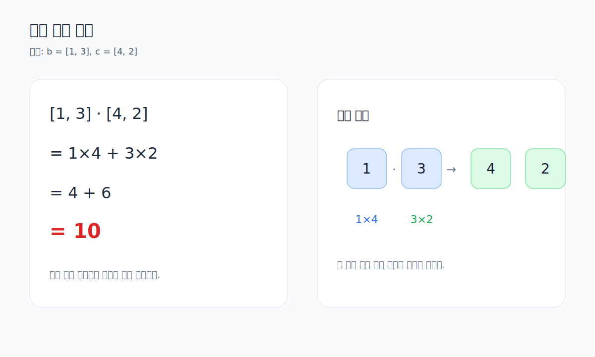

# 01. 내적 계산 원리

이 문서는 내적을 어떻게 계산하는지 가장 기본적인 수준에서 설명합니다.

연결 실습
- [../week04_Vector_DotProduct.ipynb](../week04_Vector_DotProduct.ipynb)
- 복습 링크: [Week03 벡터 기초](../../week03/notes/04_vectors_and_advanced_ops.md)

## 1. 예제: `b.dot(c)`

```python
b = np.array([1, 3])
c = np.array([4, 2])

print(b.dot(c))
```



## 2. 손계산 방법

내적은 같은 위치 원소끼리 곱한 뒤 모두 더합니다.

`[1, 3] · [4, 2]`
`= 1*4 + 3*2`
`= 4 + 6`
`= 10`

## 3. 왜 중요한가?

내적은 단순 계산처럼 보이지만, 실제로는
- 두 벡터가 얼마나 같은 방향을 보는지
- 서로 얼마나 관련 있는지
- 협력하는지, 무관한지, 반대인지

를 수치로 보여 줍니다.
