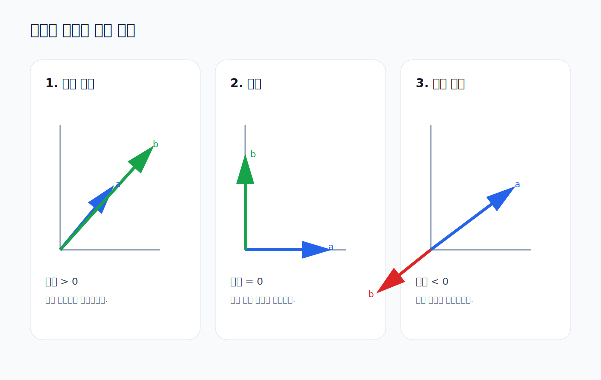

# 02. 방향과 부호 해석

이 문서는 내적의 부호가 왜 중요한지 설명합니다.

연결 실습
- [../week04_Vector_DotProduct.ipynb](../week04_Vector_DotProduct.ipynb)



## 1. 같은 방향

```python
same_a = np.array([1, 2])
same_b = np.array([2, 4])
print(np.dot(same_a, same_b))
```

결과는 양수입니다.

해석
- 같은 방향으로 움직입니다.
- 서로 힘을 합치는 느낌으로 이해할 수 있습니다.
- 따라서 내적은 `> 0` 입니다.

## 2. 수직

```python
perp_a = np.array([1, 0])
perp_b = np.array([0, 2])
print(np.dot(perp_a, perp_b))
```

결과는 `0` 입니다.

해석
- 한 벡터가 다른 벡터 방향에 기여하지 않습니다.
- 서로 관련이 없는 방향이라고 볼 수 있습니다.
- 따라서 내적은 `= 0` 입니다.

## 3. 반대 방향

```python
opp_a = np.array([1, 2])
opp_b = np.array([-2, -4])
print(np.dot(opp_a, opp_b))
```

결과는 음수입니다.

해석
- 서로 반대로 움직입니다.
- 충돌하거나 상쇄하는 관계로 볼 수 있습니다.
- 따라서 내적은 `< 0` 입니다.
