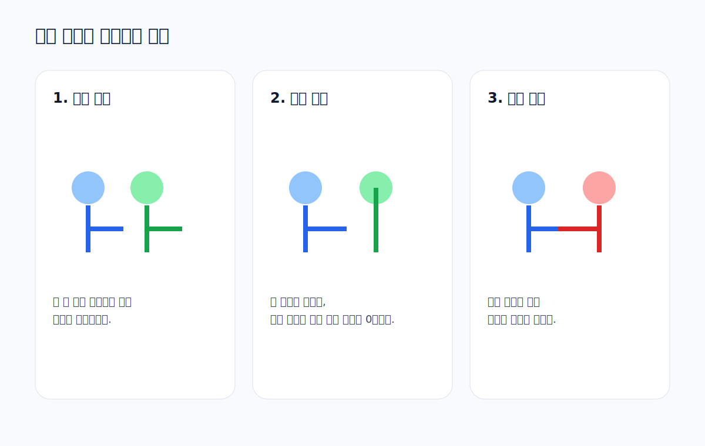

# 03. 사람 비유로 이해하는 내적

수학적 정의만 보면 내적은 딱딱해 보일 수 있습니다.
사람 비유로 보면 훨씬 직관적입니다.

연결 실습
- [../week04_Vector_DotProduct.ipynb](../week04_Vector_DotProduct.ipynb)

## 1. 같은 방향으로 협력하는 경우

두 사람이 같은 목표를 향해 함께 밀면 결과는 크게 나옵니다.

해석
- 내적은 양수
- 같은 방향
- 협력 관계

## 2. 서로 무관한 경우

한 사람은 오른쪽으로, 다른 사람은 위쪽으로만 움직인다면 서로 방향 기여가 없습니다.

해석
- 내적은 0
- 수직 관계
- 관련 없음

## 3. 반대로 충돌하는 경우

한 사람은 앞으로 밀고, 다른 사람은 뒤로 당기면 서로 상쇄됩니다.

해석
- 내적은 음수
- 반대 방향
- 충돌 관계

## 4. 왜 이 비유가 중요한가?

내적은 나중에
- 추천 시스템 유사도
- 문장 임베딩 유사도
- 머신러닝 특징 벡터 비교

를 이해할 때 다시 등장합니다.
