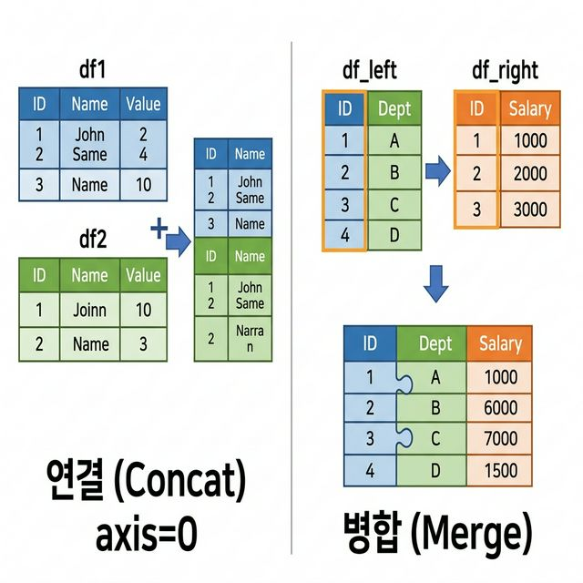
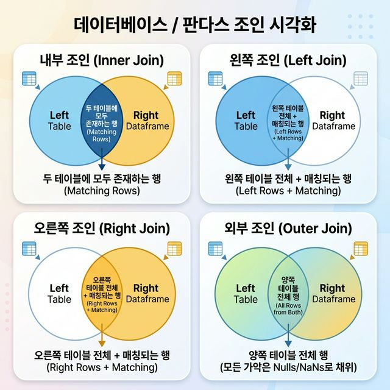

# Week 06 Note: Pandas 병합과 연결

## 1. 이 주제의 목적

6주차의 목표는 `Pandas`에서 여러 `DataFrame`을 하나로 다루는 두 가지 핵심 방식, 즉 `concat()`과 `merge()`를 정확히 구분하고 상황에 맞게 사용하는 것입니다. 이번에는 추상 예제가 아니라 실제 월별 매출 엑셀 파일 `sales-jan-2014.xlsx`, `sales-feb-2014.xlsx`, `sales-mar-2014.xlsx`를 기준으로 정리합니다. 여기에 더해 실습에서 함께 쓰는 `NumPy`의 기본 함수 `linspace`, `sin`, `cos`, `tan`, `exp`, 그리고 `matplotlib`의 `subplots(2,2)`, `plot`, `ax` 사용법, `Pandas`의 기초 확인 함수도 함께 묶어서 정리합니다.

이 주차에서 가장 중요한 질문은 문법이 아니라 아래입니다.

- 이 표들은 그냥 이어 붙이면 되는가?
- 아니면 공통 기준을 보고 매칭해야 하는가?
- 어떤 표를 기준으로 결과를 남겨야 하는가?

즉, 6주차는 단순 함수 사용법보다 데이터 관계를 읽는 훈련에 가깝습니다. 여기에 더해 연결과 병합이 끝난 결과를 빠르게 검증하기 위한 `matplotlib` 시각화와, 그래프를 그리기 위해 필요한 `NumPy` 함수 워밍업도 함께 다룹니다. 교수님이 함께 제공한 함수 표면·gradient 시각화 코드는 별도 부록 성격으로 함께 정리합니다.

## 2. 왜 중요한가

실제 데이터는 보통 한 파일에 다 들어 있지 않습니다.

- 학생 정보표와 성적표가 따로 있을 수 있고
- 사용자 정보표와 구매 이력표가 분리되어 있을 수 있고
- 월별 데이터가 파일별로 나뉘어 있을 수 있습니다

이번 실습이 정확히 그 경우입니다. 2014년 1월, 2월, 3월 매출이 각각 다른 엑셀 파일에 저장되어 있으므로 먼저 연결이 필요하고, 이후 고객 보조 정보와 결합하려면 병합이 필요합니다.

이때 필요한 작업이 바로 병합과 연결입니다.

- 같은 구조의 표를 이어 붙이면 `concat()`
- 공통 열을 기준으로 서로 다른 정보를 결합하면 `merge()`

즉, 이 주제는 흩어진 데이터를 하나의 의미 있는 데이터셋으로 만드는 방법입니다.

## 3. 선수 개념

이번 주차를 보기 전에 아래 정도는 알고 있으면 좋습니다.

- 파이썬 `dict`, `list`
- `pd.DataFrame()` 기본 생성 방식
- 행과 열의 차이
- 결측치 `NaN` 의미

연결 포인트
- 실습 코드: [../../week06_Pandas_Merge_Concat.ipynb](../../week06_Pandas_Merge_Concat.ipynb)
- 실습 데이터: [data/sales-jan-2014.xlsx](./data/sales-jan-2014.xlsx)
- 실습 데이터: [data/sales-feb-2014.xlsx](./data/sales-feb-2014.xlsx)
- 실습 데이터: [data/sales-mar-2014.xlsx](./data/sales-mar-2014.xlsx)
- 이전 주차 구조 감각: [../week03/Week03_Note.md](../week03/Week03_Note.md)
- 배열과 함수 기초: [../week03/Week03_Note.md](../week03/Week03_Note.md)

## 4. 핵심 개념과 용어 해설

### 4-1. `NumPy` 기초 함수 워밍업

이번 실습에서는 `Pandas`가 중심이지만, 그래프를 그리기 전에 `NumPy` 함수들을 같이 다룹니다.

```python
x = np.linspace(-1, 1, 100)
y_sin = np.sin(x)
y_cos = np.cos(x)
y_tan = np.tan(x)
y_exp = np.exp(x)
```

각 함수에서 떠올려야 할 것
- `np.linspace(-1, 1, 100)`: `-1`부터 `1`까지 구간을 100개 점으로 균등 분할
- `np.sin(x)`: 사인 함수
- `np.cos(x)`: 코사인 함수
- `np.tan(x)`: 탄젠트 함수
- `np.exp(x)`: 지수 함수

왜 필요한가
- 그래프는 연속적인 x값이 있어야 자연스럽게 그릴 수 있기 때문입니다.
- 수학 함수 그래프와 매출 요약 그래프를 함께 보면서 `matplotlib` 기초 문법을 익히기 좋기 때문입니다.

### 4-2. 실습 데이터 구성

이번 실습 데이터는 아래 3개 파일입니다.

- `sales-jan-2014.xlsx`
- `sales-feb-2014.xlsx`
- `sales-mar-2014.xlsx`

각 파일은 같은 열 구조를 가지고 있습니다.

- `account number`
- `name`
- `sku`
- `quantity`
- `unit price`
- `ext price`
- `date`

행 수
- 1월: 134행
- 2월: 108행
- 3월: 142행

이 구조를 보면 바로 떠올려야 할 것
- 열 구조가 같으므로 `concat(axis=0)`이 자연스럽다
- 이후 고객 보조 정보표를 붙일 때는 `merge()`가 필요하다

### 4-3. `DataFrame`

`DataFrame`은 Pandas의 기본 표 구조입니다.

```python
raw_data = {
    "subject_id": ["1", "2", "3", "4", "5"],
    "test_score": [51, 15, 15, 61, 16]
}

df_score = pd.DataFrame(raw_data, columns=["subject_id", "test_score"])
```

이 코드가 의미하는 것
- 파이썬 자료구조를 병합 가능한 표 구조로 바꾸는 단계입니다.

왜 필요한가
- `concat()`과 `merge()`는 `DataFrame`끼리 수행하는 연산이기 때문입니다.

### 4-4. 키 열(key column)

병합에서 가장 중요한 개념은 키 열입니다. 키 열은 서로 다른 표에서 같은 대상을 식별하는 기준입니다.

```python
df_left = pd.DataFrame({
    "subject_id": ["1", "2", "3", "4"],
    "first_name": ["Alex", "Amy", "Allen", "Alice"]
})

df_right = pd.DataFrame({
    "subject_id": ["1", "2", "3", "5"],
    "test_score": [51, 15, 15, 61]
})
```

여기서 `subject_id`를 보면 떠올려야 하는 것
- 병합 기준점
- 같은 사람인지 판별하는 식별자
- 값이 어긋나면 병합 결과도 어긋난다

> **참고 시각 자료: 연결(Concat) vs 병합(Merge)**
> 

### 4-5. `concat()`

`concat()`은 표를 이어 붙이는 함수입니다.

```python
sales_all = pd.concat(
    [frame.assign(month=month) for month, frame in monthly_frames.items()],
    axis=0,
    ignore_index=True
)
```

핵심
- `axis=0`: 위아래 연결
- `axis=1`: 좌우 연결

왜 필요한가
- 같은 구조의 데이터가 여러 조각으로 나뉘어 있을 때 하나로 합치기 위해서입니다.
- 이번 실습에서는 1월, 2월, 3월 엑셀 파일을 하나의 매출표로 통합하기 위해 사용합니다.

기억할 문장
- `concat()`은 "매칭"보다 "연결"입니다.

### 4-6. `merge()`

`merge()`는 공통 열을 기준으로 서로 다른 정보를 결합하는 함수입니다.

```python
customer_with_meta = pd.merge(
    customer_summary,
    account_meta,
    on="account number",
    how="left"
)
```

왜 필요한가
- 매출 요약표와 고객 메타데이터처럼 서로 다른 속성을 가진 표를 하나로 맞춰야 하기 때문입니다.

기억할 문장
- `merge()`는 "이어 붙이기"가 아니라 "키 기준 매칭"입니다.

### 4-7. 조인 종류



#### `inner`

```python
pd.merge(df_left, df_right, on="subject_id", how="inner")
```

의미
- 양쪽에 모두 존재하는 키만 남김
- 교집합

#### `left`

```python
pd.merge(df_left, df_right, on="subject_id", how="left")
```

의미
- 왼쪽 표를 기준으로 모두 남김
- 오른쪽에 없으면 `NaN`

#### `right`

```python
pd.merge(df_left, df_right, on="subject_id", how="right")
```

의미
- 오른쪽 표를 기준으로 모두 남김

#### `outer`

```python
pd.merge(df_left, df_right, on="subject_id", how="outer")
```

의미
- 양쪽의 모든 키를 다 남김
- 합집합

시험장에서 기억할 문장
- `inner`: 둘 다 있는 것만
- `left`: 왼쪽 기준 보존
- `right`: 오른쪽 기준 보존
- `outer`: 전체 보존

### 4-8. 자주 쓰는 옵션

#### 열 이름이 다를 때

```python
pd.merge(df_left, df_attendance, left_on="subject_id", right_on="id", how="left")
```

왜 필요한가
- 실제 데이터에서는 같은 의미인데 열 이름이 다른 경우가 많기 때문입니다.

#### 같은 이름의 일반 열이 겹칠 때

```python
pd.merge(midterm, final, on="subject_id", suffixes=("_mid", "_final"))
```

왜 필요한가
- 병합 후 열 이름 충돌을 막고 의미를 보존하기 위해서입니다.

#### 병합 결과 출처 확인

```python
pd.merge(df_left, df_right, on="subject_id", how="outer", indicator=True)
```

왜 필요한가
- `left_only`, `right_only`, `both`로 어느 쪽에서 왔는지 검증할 수 있기 때문입니다.

### 4-9. `matplotlib`

`matplotlib`은 `Pandas`로 정리한 결과를 눈으로 빠르게 검증할 때 가장 기본이 되는 시각화 도구입니다.

이번 실습에서는 아래 흐름으로 사용하는 것이 자연스럽습니다.

1. `read_excel()`로 월별 파일을 읽는다
2. `concat()`으로 하나의 표로 합친다
3. `groupby()`로 월별 매출이나 고객별 매출을 요약한다
4. `matplotlib`으로 막대그래프와 선그래프로 흐름을 확인한다

기초 예시

```python
fig, axes = plt.subplots(2, 2, figsize=(10, 6))

axes[0, 0].plot(x, np.sin(x))
axes[0, 0].set_title('sin(x)')

axes[0, 1].plot(x, np.cos(x))
axes[0, 1].set_title('cos(x)')

axes[1, 0].plot(x, np.tan(x))
axes[1, 0].set_title('tan(x)')

axes[1, 1].plot(x, np.exp(x))
axes[1, 1].set_title('exp(x)')
```

여기서 떠올려야 할 것
- `subplots(2,2)`: 2행 2열 그래프 틀 만들기
- `fig`: 전체 그림 객체
- `axes`: 각 개별 그래프 축 객체
- `ax.plot(...)`: 특정 축에 선그래프 그리기

왜 필요한가
- `plt.plot()`만 쓰면 하나의 그래프는 쉽게 그릴 수 있지만, 여러 그래프를 비교하려면 `subplots`와 `ax`를 다룰 수 있어야 하기 때문입니다.

매출 데이터 예시

```python
plt.figure(figsize=(8, 4))
plt.bar(monthly_summary['month'], monthly_summary['total_sales'], color='steelblue')
plt.title('Monthly Total Sales')
plt.xlabel('Month')
plt.ylabel('Total Sales')
plt.show()
```

이 코드를 보면 떠올려야 하는 것
- `figure`: 그림 크기 설정
- `bar`: 범주형 비교에 적합한 막대그래프
- `plot`: 추세를 볼 때 적합한 선그래프
- `xlabel`, `ylabel`, `title`: 그래프 의미를 명확히 적는 기본 요소

왜 필요한가
- 숫자 표만 보면 놓치기 쉬운 월별 증가/감소 흐름을 바로 볼 수 있기 때문입니다.
- 병합과 연결이 제대로 되었는지 결과를 빠르게 검증할 수 있기 때문입니다.

### 4-10. `Pandas` 기본 확인 함수

실제 실습에서는 `concat()`과 `merge()`만 쓰지 않습니다. 그 전에 `DataFrame` 상태를 빠르게 확인하는 기본 함수들이 매우 중요합니다.

대표 함수
- `head()`: 앞부분 5행 확인
- `tail()`: 뒷부분 5행 확인
- `info()`: 열 이름, 자료형, 결측치 개수 확인
- `describe()`: 수치형 열의 요약 통계 확인
- `value_counts()`: 범주별 개수 확인
- `sort_values()`: 정렬
- `groupby()`: 묶어서 집계

예시

```python
jan_df.head()
jan_df.info()
jan_df.describe()
jan_df['name'].value_counts().head()
jan_df.sort_values('ext price', ascending=False).head()
```

왜 필요한가
- 파일을 읽은 직후 데이터 상태를 점검해야 이후 연결과 병합 실수를 줄일 수 있기 때문입니다.
- 요약 통계와 정렬 결과를 먼저 보면 데이터 분포를 빨리 파악할 수 있기 때문입니다.

## 5. 실습 파일과 핵심 흐름

관련 실습
- [../../week06_Pandas_Merge_Concat.ipynb](../../week06_Pandas_Merge_Concat.ipynb)
- [data/sales-jan-2014.xlsx](./data/sales-jan-2014.xlsx)
- [data/sales-feb-2014.xlsx](./data/sales-feb-2014.xlsx)
- [data/sales-mar-2014.xlsx](./data/sales-mar-2014.xlsx)

추천 실습 순서
1. 3개의 월별 엑셀 파일을 `pd.read_excel()`로 읽기
2. `concat(axis=0)`로 3개월 데이터를 연결하기
3. `shape`, `columns`, `dtypes` 점검하기
4. `head()`, `info()`, `describe()`, `value_counts()`, `sort_values()`로 데이터 상태 확인하기
5. `groupby()`로 월별 매출과 고객별 매출 요약하기
6. `matplotlib`의 `subplots(2,2)`, `ax.plot`, 막대그래프로 시각화하기
7. 고객 메타데이터 표를 만들어 `merge()`하기
8. `indicator=True`로 병합 누락 점검하기
9. 교수님 추가 코드인 2D/3D gradient 시각화 예제 보기

실습 중 계속 확인할 질문
- 지금 이 표들은 누적 관계인가, 매칭 관계인가?
- 기준이 되는 키 열은 무엇인가?
- 병합 후 `NaN`이 생기면 왜 생겼는가?
- 지금 그래프를 그릴 x값은 `linspace` 같은 균등 구간이 필요한가?
- 여러 그래프를 한 화면에 보여 주려면 `plt.plot()`보다 `subplots`와 `ax`가 더 적절한가?
- 그래프로 그렸을 때 연결 결과의 추세가 자연스럽게 보이는가?
- 이 시각화 코드는 이번 주 핵심 주제와 직접 연결되는가, 아니면 별도 부록 성격인가?

## 6. 자주 하는 실수

### 실수 1. `concat()`과 `merge()`를 같은 것으로 생각함

올바른 방향
- `concat()`은 연결
- `merge()`는 키 기준 병합

### 실수 2. 키 열을 확인하지 않고 병합함

올바른 방향
- 공통 열 이름, 자료형, 중복 여부를 먼저 봐야 합니다.

### 실수 3. `NaN`을 함수 오류로 생각함

올바른 방향
- `NaN`은 종종 정상적인 병합 결과입니다.
- 어떤 키가 없었는지 먼저 봐야 합니다.

### 실수 4. `concat(axis=1)`를 병합처럼 사용함

올바른 방향
- 순서 기반 결합과 키 기반 결합은 다릅니다.
- 객체 기준 매칭이 필요하면 `merge()`가 우선입니다.

### 실수 5. 열 이름 오타를 놓침

올바른 방향
- 수업 예시에서 `test_scor` 같은 오타가 보이면 실제 코드는 반드시 확인해야 합니다.

### 실수 6. 같은 구조의 월별 파일인데 `merge()`부터 하려고 함

올바른 방향
- 열 구조가 같고 누적 관계라면 먼저 `concat()`을 떠올려야 합니다.
- `merge()`는 공통 키를 기준으로 서로 다른 정보를 붙일 때 사용합니다.

### 실수 7. 숫자형 변환 전에 그래프를 그림

올바른 방향
- `date`는 날짜형으로, `ext price`와 `quantity`는 숫자형으로 정리한 뒤 그려야 합니다.
- 시각화 전 자료형 점검은 필수입니다.

### 실수 8. 그래프 제목과 축 라벨을 생략함

올바른 방향
- `title`, `xlabel`, `ylabel`을 적어야 그래프 해석이 쉬워집니다.
- 시험이나 보고서에서는 "무엇을 보여 주는 그래프인지"를 명확히 써야 합니다.

### 실수 9. `subplots(2,2)`를 만들고도 계속 `plt.plot()`만 사용함

올바른 방향
- 여러 그래프를 동시에 그릴 때는 `axes[0,0]`, `axes[0,1]`처럼 각 축 객체에 직접 그려야 합니다.

### 실수 10. `tan(x)` 그래프의 급격한 발산을 그대로 두고 해석함

올바른 방향
- `tan`은 특정 구간에서 값이 급격히 커질 수 있으므로 `set_ylim()` 같은 축 제한을 같이 고려해야 합니다.

## 7. 시험 대비 포인트

시험 직전에는 아래를 설명할 수 있어야 합니다.

- `concat()`과 `merge()` 차이
- 키 열이 왜 중요한가
- `inner`, `left`, `right`, `outer` 차이
- `NaN`이 생기는 이유
- `np.linspace`, `sin`, `cos`, `tan`, `exp`의 역할
- `pd.read_excel()`로 여러 월 파일을 읽고 연결하는 흐름
- `subplots(2,2)`, `ax.plot`의 의미
- `head`, `info`, `describe`, `value_counts`, `sort_values`, `groupby`의 역할
- `groupby()` 결과를 `matplotlib`으로 시각화하는 흐름
- `left_on`, `right_on`, `suffixes`, `indicator=True`의 목적
- 추가 제공 gradient 코드가 6주차 핵심 실습과는 별도임을 구분하는 설명

서술형 답안 구조 예시

> Pandas에서 여러 `DataFrame`을 합칠 때는 `concat()`과 `merge()`를 사용한다. 예를 들어 1월, 2월, 3월 매출 엑셀 파일처럼 같은 구조의 월별 데이터는 `pd.read_excel()`로 읽은 뒤 `concat()`으로 위아래 연결한다. 이후 `head()`, `info()`, `describe()`로 데이터 상태를 확인하고, `groupby()`로 월별 매출을 요약한다. 시각화가 필요하면 `matplotlib`의 `subplots(2,2)`와 `ax.plot` 또는 막대그래프를 사용해 결과를 확인할 수 있다. 그 후 고객 지역이나 세그먼트 같은 추가 정보는 공통 키인 `account number`를 기준으로 `merge()`한다. `merge()`에서는 `inner`, `left`, `right`, `outer` 조인을 선택할 수 있고, 기준 표에 없는 데이터는 `NaN`으로 나타날 수 있다.

## 8. 기존 문서와 연결 포인트

- 실습 코드: [../../week06_Pandas_Merge_Concat.ipynb](../../week06_Pandas_Merge_Concat.ipynb)
- 실습 데이터: [data/sales-jan-2014.xlsx](./data/sales-jan-2014.xlsx)
- 실습 데이터: [data/sales-feb-2014.xlsx](./data/sales-feb-2014.xlsx)
- 실습 데이터: [data/sales-mar-2014.xlsx](./data/sales-mar-2014.xlsx)
- 보충 문서: [notes/00_dataframe_and_keys.md](./notes/00_dataframe_and_keys.md)
- 보충 문서: [notes/01_concat_basics.md](./notes/01_concat_basics.md)
- 보충 문서: [notes/02_merge_join_types.md](./notes/02_merge_join_types.md)
- 보충 문서: [notes/03_merge_options_and_cautions.md](./notes/03_merge_options_and_cautions.md)
- 보충 문서: [notes/04_practice_walkthrough.md](./notes/04_practice_walkthrough.md)

## 9. 빠른 요약

- 6주차의 핵심은 `concat()`과 `merge()`를 구분하는 것입니다.
- `np.linspace`, `sin`, `cos`, `tan`, `exp`는 그래프와 수치 함수 워밍업에 자주 쓰입니다.
- `subplots(2,2)`와 `ax.plot`을 쓰면 여러 그래프를 한 번에 정리할 수 있습니다.
- `head`, `info`, `describe`, `value_counts`, `sort_values`, `groupby`는 판다스 기본 확인 함수입니다.
- `sales-jan`, `sales-feb`, `sales-mar`처럼 같은 구조의 월별 엑셀은 먼저 `concat()`으로 연결합니다.
- 연결 후 `groupby()` 결과는 `matplotlib`으로 시각화하면 검증이 쉬워집니다.
- 고객 메타정보처럼 다른 속성표를 붙일 때는 `merge()`를 씁니다.
- 키 열, 자료형, 중복 여부를 먼저 봐야 합니다.
- 교수님 제공 gradient 코드는 참고용 추가 코드로 분리해서 보는 것이 좋습니다.
