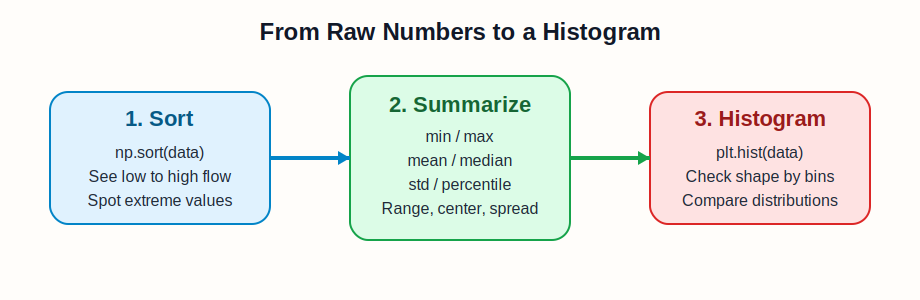
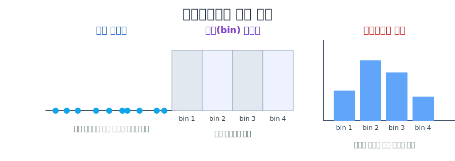
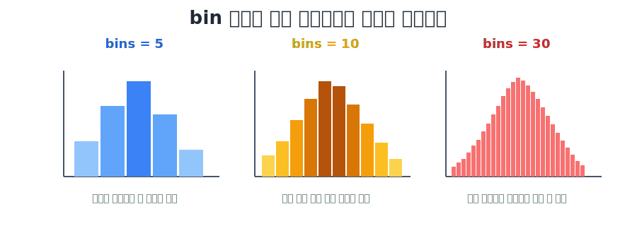
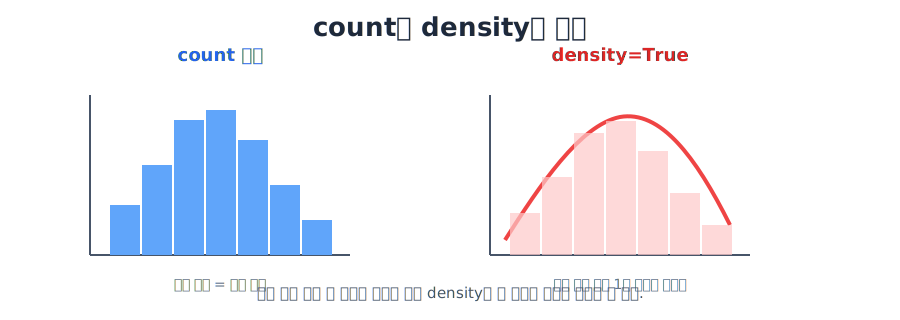
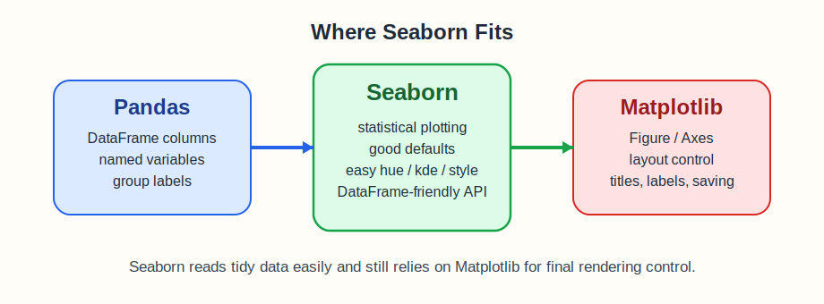
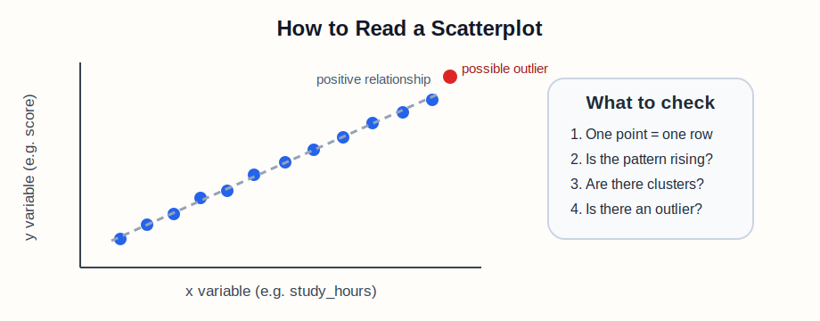
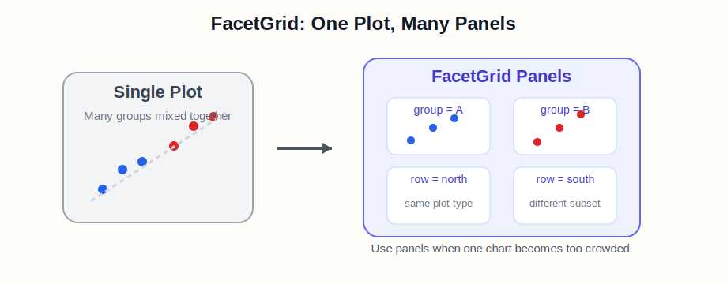
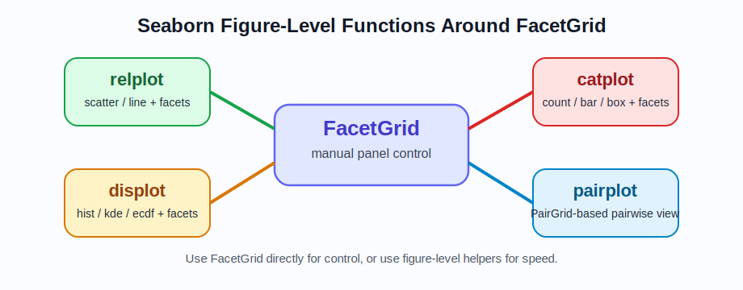
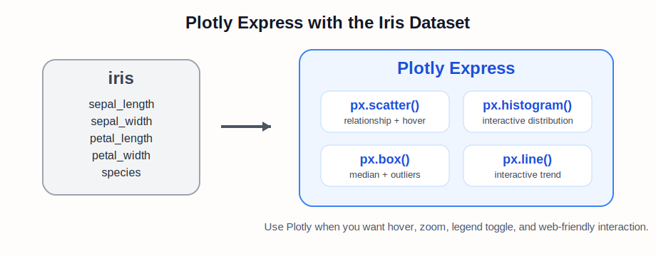

# Week 07 Note: Matplotlib 히스토그램, Seaborn, Plotly

## 1. 이 주제의 목적

7주차의 목표는 숫자 데이터와 관계형 데이터를 그래프로 읽는 기본 감각을 잡는 것입니다.  
이번 주차는 두 단계로 누적해서 진행합니다.

1. `matplotlib`로 히스토그램을 그리고 분포를 읽는다.
2. 같은 흐름을 `seaborn`으로 확장해서 더 분석 친화적으로 시각화한다.
3. 그래프를 그리기 전에 어떤 전처리 문제가 있는지도 함께 점검한다.

즉, 7주차는 단순히 그래프를 "그리는 법"만 배우는 주차가 아닙니다.  
어떤 상황에서 어떤 그래프를 써야 하는지 판단하는 주차입니다.

이번 주차가 끝나면 아래 질문에 답할 수 있어야 합니다.

- 숫자 데이터가 어떤 구간에 몰려 있는지 어떻게 보는가
- 시간에 따라 값이 어떻게 변하는지 어떻게 보는가
- 두 수치형 변수 사이의 관계는 어떤 그래프로 보는가
- 같은 그래프를 그룹별로 나누어 여러 패널로 보는 방법은 무엇인가
- 같은 데이터를 상호작용 가능한 그래프로 보는 방법은 무엇인가
- `matplotlib`와 `seaborn`은 어떤 관계인가
- 그래프를 그리기 전에 어떤 데이터 품질 문제를 먼저 의심해야 하는가

## 2. 왜 중요한가

데이터 분석에서는 표를 숫자로만 보는 것보다, 그래프로 바꾸어 읽는 순간 이해가 빨라집니다.

- 평균만 보면 분포 모양을 놓칠 수 있습니다
- 분포만 보면 시간 흐름을 놓칠 수 있습니다
- 시간 흐름만 보면 변수 사이 관계를 놓칠 수 있습니다
- 그래프를 바로 그리면 결측치, 이상치, 스케일 차이 같은 전처리 문제를 놓칠 수 있습니다

그래서 이번 주차에서는 아래 세 가지를 구분해야 합니다.

- `hist()` / `histplot()`: 분포
- `lineplot()`: 시간 흐름, 추세
- `scatterplot()`: 두 변수 사이 관계

그리고 이 그래프들을 "보기 좋은 그림"이 아니라 "전처리 점검 도구"로도 읽어야 합니다.

- 히스토그램은 치우친 분포와 이상치를 의심하게 해 줍니다
- 선그래프는 시간에 따른 드리프트를 의심하게 해 줍니다
- 산점도는 이상치, 군집, 스케일 문제를 의심하게 해 줍니다

이 구분이 잡혀야 이후 데이터 분석, 머신러닝 전처리, 결과 해석도 자연스럽게 이어집니다.

## 3. 선수 개념

이번 주차를 보기 전에 아래 정도는 이해하고 있으면 좋습니다.

- `NumPy` 배열과 난수 생성
- `Pandas DataFrame`과 `Series`
- `matplotlib`의 `figure`, `subplot`, `subplots`, `plot`
- `Pandas`의 `sort_values()`

연결 포인트
- 배열과 난수 기초: [../week03/Week03_Note.md](../week03/Week03_Note.md)
- `Pandas`와 `matplotlib` 기본 복습: [../week06/Week06_Note.md](../week06/Week06_Note.md)
- 실습 코드: [./week07_Matplotlib_Seaborn.ipynb](./week07_Matplotlib_Seaborn.ipynb)
- 실습 데이터: [data/fmri.csv](./data/fmri.csv)

## 4. 핵심 개념과 용어 해설

### 4-0. 데이터 전처리의 기초

전처리(preprocessing)는 모델을 만들기 전에 데이터를 점검하고, 정리하고, 비교 가능한 상태로 만드는 과정입니다.  
이번 주차에서는 시각화가 중심이지만, 실제로는 그래프를 그리기 전에 전처리 관점이 먼저 들어와야 합니다.

전처리 문제는 크게 두 묶음으로 나누어 생각하면 정리가 쉽습니다.

#### 1. 데이터 품질 문제

데이터 자체가 깨끗하지 않아서 생기는 문제입니다.

- 결측치: 값이 비어 있음
- 중복 행: 같은 데이터가 여러 번 들어감
- 자료형 오류: 숫자여야 하는데 문자열로 들어감
- 표기 불일치: `Seoul`, `SEOUL`, `seoul`처럼 같은 의미가 다르게 적힘
- 불가능한 값: 나이가 `-3`, 점수가 `1000`처럼 상식적으로 맞지 않음
- 단위 혼합: 키가 `cm`와 `m`가 섞여 있음

이런 문제는 평균, 분포, 그룹 비교를 모두 왜곡할 수 있습니다.

#### 2. 데이터 분포 문제

값은 들어 있지만, 분포 특성 때문에 바로 비교하거나 학습하기 어려운 문제입니다.

- 스케일 차이: 어떤 변수는 0~1, 다른 변수는 0~100000
- 지나친 치우침(skewness): 한쪽으로 값이 몰림
- 이상치(outlier): 대부분과 너무 멀리 떨어진 값
- 클래스 불균형: 한 범주는 매우 많고 다른 범주는 매우 적음
- 학습 데이터와 실제 데이터의 분포 차이: train/test 또는 과거/현재 데이터 차이
- 시간에 따른 드리프트(drift): 시간이 지나며 분포가 바뀜

이 문제들은 모델 성능과 해석을 동시에 흔듭니다.

예를 들어
- 평균만 보면 이상치 때문에 중심을 잘못 읽을 수 있고
- 히스토그램을 보면 분포가 한쪽으로 몰린 것을 확인할 수 있고
- 산점도를 보면 일부 점만 멀리 튀는 이상치를 확인할 수 있습니다

#### 전처리를 볼 때 기본 사고 흐름

1. 결측치가 있는가
2. 중복 데이터가 있는가
3. 자료형과 단위가 일관적인가
4. 범주형 표기가 통일되어 있는가
5. 이상치나 지나친 치우침이 있는가
6. 변수들 사이 스케일 차이가 큰가
7. 집단 간 분포 차이가 지나치게 큰가
8. 시간 흐름에 따라 분포가 바뀌는가

아주 기초적인 확인 코드는 아래처럼 시작합니다.

```python
df.isna().sum()
df.duplicated().sum()
df.dtypes
df.describe()
```

결측치를 실제로 채울 때 가장 자주 보는 함수는 `fillna()`입니다.

#### `df.fillna(0)`

```python
df.fillna(0)
```

의미
- 비어 있는 값을 모두 `0`으로 채웁니다.

왜 필요한가
- 계산이나 그래프 함수가 `NaN` 때문에 불편할 때 빠르게 기본값을 넣을 수 있습니다.

주의할 점
- 모든 결측치를 무조건 `0`으로 채우는 것은 위험할 수 있습니다.
- 점수, 가격, 키처럼 원래 `0`이 의미를 가지는 변수에서는 실제 값과 결측치를 구분하기 어려워질 수 있습니다.

예를 들면 아래와 같습니다.

```python
df_fill_zero = df.fillna(0)
```

결과 해석
- 원래 비어 있던 칸이 `0`으로 바뀝니다.
- 숫자 열뿐 아니라 문자열 열도 `0`이 들어갈 수 있으므로 열 의미를 먼저 확인해야 합니다.

#### 열별로 다른 값으로 채우기

실제 전처리에서는 모든 열을 같은 값으로 채우기보다, 열 의미에 따라 다르게 채우는 경우가 많습니다.

```python
df["score"] = df["score"].fillna(df["score"].mean())
df["group"] = df["group"].fillna("unknown")
```

의미
- 수치형 열은 평균 같은 대표값으로 채우고
- 범주형 열은 `"unknown"` 같은 별도 범주로 채웁니다

왜 필요한가
- 열마다 결측치가 생긴 이유와 자료형이 다르기 때문입니다.

#### `ffill()`과 `bfill()`

시계열이나 순서형 데이터에서는 앞값이나 뒷값으로 채우기도 합니다.

```python
df.ffill()
df.bfill()
```

의미
- `ffill()`: 앞에 있던 값으로 채움
- `bfill()`: 뒤에 있던 값으로 채움

왜 필요한가
- 센서 데이터나 날짜 순서 데이터처럼 값이 연속적으로 이어질 때 자연스러운 보정이 될 수 있기 때문입니다.

주의할 점
- 행 순서에 의미가 없는데 `ffill()`이나 `bfill()`을 쓰면 잘못된 값이 퍼질 수 있습니다.

필요하면 다음 단계로 이어집니다.

```python
df = df.drop_duplicates()
df["price"] = df["price"].astype(float)
df["city"] = df["city"].str.strip().str.lower()
```

이번 주차 시각화와 연결하면 아래처럼 이해할 수 있습니다.

- `hist()` / `histplot()`: 치우침, 이상치, 집단별 분포 차이 확인
- `lineplot()`: 시간에 따른 드리프트 확인
- `scatterplot()`: 두 변수 관계와 이상치, 군집 확인
- `FacetGrid`: 집단별 패턴 차이 확인
- `px.parallel_coordinates()`: 여러 변수의 스케일과 패턴 차이 확인

결국 `fillna()`도 단순 암기 함수가 아니라, "왜 이 결측치를 이렇게 채우는가"를 먼저 설명할 수 있어야 합니다.

시험장에서 핵심은 "전처리 문제의 이름"만 말하는 것이 아닙니다.  
그 문제가 왜 위험한지, 어떤 그래프나 함수로 먼저 확인할 수 있는지까지 연결해서 설명해야 합니다.

### 4-1. 히스토그램 전에 먼저 보는 기초 함수

히스토그램은 분포를 한눈에 보여 주는 도구입니다.  
하지만 그래프를 그리기 전에 숫자 데이터 상태를 먼저 점검하는 습관이 중요합니다.

> **참고 시각 자료: 정렬에서 히스토그램으로 가는 흐름**
> 

핵심 흐름
- 먼저 정렬해서 값의 순서를 본다
- 최솟값과 최댓값으로 범위를 본다
- 평균과 중앙값으로 중심을 본다
- 표준편차와 사분위수로 퍼짐을 본다
- 그 다음에 히스토그램으로 전체 분포 모양을 본다

#### `np.sort()`

```python
sorted_data = np.sort(data)
```

의미
- 데이터를 작은 값부터 큰 값까지 정렬합니다.

왜 필요한가
- 값의 흐름을 직접 볼 수 있습니다.
- 앞쪽과 뒤쪽 끝값을 통해 이상치 감각도 얻을 수 있습니다.

#### `np.min()`, `np.max()`

```python
data_min = np.min(data)
data_max = np.max(data)
```

의미
- 데이터의 최솟값과 최댓값을 구합니다.

왜 필요한가
- 값이 어느 범위에 있는지 알 수 있습니다.
- 히스토그램 x축 해석의 기준이 됩니다.

#### `np.mean()`, `np.median()`

```python
data_mean = np.mean(data)
data_median = np.median(data)
```

의미
- `mean`: 산술평균
- `median`: 중앙값

왜 필요한가
- 데이터 중심이 어디쯤인지 알 수 있습니다.
- 이상치가 있으면 평균과 중앙값 차이도 의미 있는 신호가 됩니다.

#### `np.std()`

```python
data_std = np.std(data)
```

의미
- 평균 주변으로 데이터가 얼마나 퍼져 있는지를 보여 줍니다.

#### `np.percentile()`

```python
q1, q2, q3 = np.percentile(data, [25, 50, 75])
```

의미
- 25%, 50%, 75% 지점을 구합니다.
- `q2`는 중앙값과 같습니다.

#### `Series.sort_values()`

```python
df["score"].sort_values()
```

왜 필요한가
- 실제 분석에서는 `NumPy` 배열보다 `Pandas` 열을 직접 다루는 경우가 많기 때문입니다.

정리하면
- `sort`: 값의 순서
- `min/max`: 범위
- `mean/median`: 중심
- `std/percentile`: 퍼짐
- `hist`: 분포 모양

### 4-2. 히스토그램이란?

히스토그램은 연속형 숫자 데이터를 여러 구간(`bin`)으로 나누고, 각 구간에 값이 몇 개 들어 있는지 막대 높이로 보여 주는 그래프입니다.

> **참고 시각 자료: 히스토그램의 기본 구조**
> 

핵심
- x축: 값의 구간
- y축: 각 구간의 개수 또는 비율

왜 중요한가
- 숫자 데이터가 어디에 몰려 있는지 빠르게 볼 수 있기 때문입니다.

### 4-3. `plt.hist()`

히스토그램의 가장 기본 함수는 `plt.hist()`입니다.

```python
plt.hist(data)
plt.show()
```

조금 더 명시적으로 쓰면 아래와 같습니다.

```python
plt.hist(data, bins=10, color="skyblue", edgecolor="black")
plt.show()
```

이 코드가 의미하는 것
- `data`: 원본 숫자 데이터
- `bins=10`: 구간을 10개로 나눔
- `color`: 막대 채우기 색
- `edgecolor`: 막대 경계선 색

### 4-4. `bins`

히스토그램에서 가장 중요한 개념은 `bins`입니다.

```python
plt.hist(data, bins=5)
plt.hist(data, bins=30)
```

같은 데이터라도 `bins` 값에 따라 그래프 모양이 크게 달라집니다.

> **참고 시각 자료: bin 개수 차이**
> 

기억할 것
- `bins`가 너무 적으면 너무 거칠게 보입니다
- `bins`가 너무 많으면 잡음이 심해 보일 수 있습니다

### 4-5. count, density, alpha, cumulative

#### count와 density

기본 히스토그램은 각 구간의 개수(`count`)를 보여 줍니다.

```python
plt.hist(data, bins=20)
```

반면 `density=True`를 주면 정규화된 분포 형태를 봅니다.

```python
plt.hist(data, bins=20, density=True)
```

> **참고 시각 자료: count vs density**
> 

왜 중요한가
- 샘플 수가 다른 집단 비교에서는 `density`가 더 공정할 수 있기 때문입니다.

#### `alpha`

```python
plt.hist(data_a, bins=20, alpha=0.5, label="A")
plt.hist(data_b, bins=20, alpha=0.5, label="B")
plt.legend()
```

의미
- `alpha`는 투명도입니다.

왜 필요한가
- 그래프를 겹쳐 그릴 때 하나가 다른 하나를 완전히 가리지 않게 하기 위해서입니다.

#### `cumulative=True`

```python
plt.hist(data, bins=20, cumulative=True)
```

왜 필요한가
- 특정 값 이하가 얼마나 누적되는지 볼 수 있기 때문입니다.

### 4-6. `ax.hist()`

여러 축을 다룰 때는 `plt.hist()`보다 `ax.hist()`가 더 관리하기 쉽습니다.

```python
fig, ax = plt.subplots(figsize=(6, 4))
ax.hist(data, bins=20, color="steelblue", edgecolor="black")
ax.set_title("Histogram")
```

기억할 것
- `plt.hist()`: 빠른 단일 그래프
- `ax.hist()`: 객체 기반 제어

### 4-7. `matplotlib`에서 `seaborn`으로 왜 확장하는가

`matplotlib`만으로도 충분히 강력한 그래프를 그릴 수 있습니다.  
하지만 실제 분석에서는 아래 요구가 자주 생깁니다.

- `DataFrame` 열 이름으로 바로 그리고 싶다
- 기본 스타일이 보기 좋았으면 좋겠다
- 그룹 비교를 더 쉽게 하고 싶다

이때 `seaborn`이 자연스럽게 이어집니다.

### 4-8. `seaborn`은 무엇인가

`seaborn`은 `matplotlib` 위에서 동작하는 통계 시각화 라이브러리입니다.

> **참고 시각 자료: seaborn의 위치**
> 

이 말을 이해할 때 떠올려야 할 것
- 내부적으로는 `matplotlib`를 활용합니다
- 더 좋은 기본 스타일을 제공합니다
- `Pandas DataFrame`과 잘 연결됩니다

### 4-9. 기본 모듈 호출과 테마 설정

```python
import numpy as np
import pandas as pd
import matplotlib.pyplot as plt
import seaborn as sns

sns.set_theme(style="whitegrid")
```

이 코드를 보면 바로 떠올려야 할 것
- `NumPy`: 수치 계산
- `Pandas`: 표 처리
- `matplotlib`: 화면과 축 제어
- `seaborn`: 분석 친화적 시각화

### 4-10. `fmri` 데이터 사용

이번 주차 후반에서는 `seaborn` 예제로 `fmri` 데이터를 사용합니다.  
실행 재현성을 위해 로컬 CSV로 함께 둡니다.

```python
fmri = pd.read_csv("data/fmri.csv")
fmri.head()
```

주요 열
- `subject`: 실험 대상
- `timepoint`: 시간 축
- `event`: 자극 종류
- `region`: 뇌 영역
- `signal`: 측정 신호

왜 중요한가
- 시간 흐름과 그룹 비교가 함께 있는 실제 형태의 데이터이기 때문입니다.

### 4-11. `sns.histplot()`

`matplotlib`의 `plt.hist()`를 배웠다면, 그 다음은 `seaborn`의 `sns.histplot()`입니다.

```python
sns.histplot(data=df_scores, x="score", bins=15)
plt.show()
```

왜 필요한가
- `DataFrame` 열 이름으로 바로 시각화할 수 있기 때문입니다.
- 그룹 비교와 스타일 확장이 더 자연스럽기 때문입니다.

자주 보는 옵션
- `bins`: 구간 수
- `kde=True`: 부드러운 분포 곡선
- `hue`: 그룹별 색상 구분
- `stat="density"`: 개수 대신 밀도 기준

> **참고 시각 자료: `histplot` 핵심 옵션**
> 

### 4-12. `sns.lineplot()`과 시간 흐름 데이터

히스토그램이 분포를 보는 도구라면, `lineplot`은 시간이나 순서에 따른 변화를 보는 도구입니다.

```python
sns.lineplot(data=fmri, x="timepoint", y="signal")
plt.show()
```

그룹 비교까지 하고 싶다면 아래처럼 확장합니다.

```python
sns.lineplot(
    data=fmri,
    x="timepoint",
    y="signal",
    hue="event",
    style="region"
)
plt.show()
```

이 코드가 의미하는 것
- `x="timepoint"`: 시간 축
- `y="signal"`: 측정값
- `hue="event"`: 자극 종류별 색 구분
- `style="region"`: 영역별 선 스타일 구분

> **참고 시각 자료: `fmri`에서 `lineplot` 읽기**
> 

### 4-13. 산점도(scatterplot)란 무엇인가

산점도는 두 수치형 변수의 값을 x축과 y축에 두고, 각 관측값을 점 하나로 표현하는 그래프입니다.

쉽게 말하면
- 점 1개 = 데이터 1개
- x축 = 첫 번째 수치형 변수
- y축 = 두 번째 수치형 변수

입니다.

> **참고 시각 자료: 산점도의 기본 해석**
> 

산점도를 보면 무엇을 읽어야 하는가
- 양의 관계: x가 커질수록 y도 커지는가
- 음의 관계: x가 커질수록 y가 작아지는가
- 군집: 점들이 그룹으로 나뉘는가
- 이상치: 다른 점들과 멀리 떨어진 점이 있는가

### 4-14. `sns.scatterplot()`

가장 기본적인 문법은 아래와 같습니다.

```python
sns.scatterplot(data=df_study, x="study_hours", y="score")
plt.show()
```

왜 필요한가
- 두 수치형 변수 사이의 관계를 시각적으로 확인할 수 있기 때문입니다.

자주 보는 옵션

#### `hue`

```python
sns.scatterplot(data=df_study, x="study_hours", y="score", hue="group")
```

역할
- 그룹별로 점 색을 다르게 합니다.

#### `style`

```python
sns.scatterplot(data=df_study, x="study_hours", y="score", hue="group", style="passed")
```

역할
- 점 모양을 다르게 합니다.

#### `size`

```python
sns.scatterplot(data=df_study, x="study_hours", y="score", size="sleep_hours")
```

역할
- 세 번째 수치 정보를 점 크기로 표현합니다.

기억할 것
- `hue`: 색
- `style`: 모양
- `size`: 크기

### 4-15. `FacetGrid`란 무엇인가

앞에서는 한 그래프 안에서 `hue`, `style`, `size`로 정보를 겹쳐 표현했습니다.  
하지만 그룹이 많아지면 한 화면에 다 겹쳐 그리는 방식이 오히려 읽기 어려워질 수 있습니다.

이럴 때 쓰는 것이 `FacetGrid`입니다.

`FacetGrid`는 같은 종류의 그래프를 여러 작은 패널로 나누어 보여 주는 구조입니다.  
즉, "그래프 자체는 같고 데이터 부분집합만 달라지는" 경우에 적합합니다.

쉽게 말하면
- 색으로 한 화면에서 겹쳐 볼 수도 있고
- 패널을 나누어 따로 볼 수도 있습니다

`FacetGrid`는 두 번째 방식입니다.

> **참고 시각 자료: FacetGrid의 기본 구조**
> 

핵심 옵션
- `row`: 행 방향으로 패널 분할
- `col`: 열 방향으로 패널 분할
- `hue`: 각 패널 안에서 색상 구분
- `col_wrap`: 열 개수를 제한하며 줄바꿈

왜 필요한가
- 한 그래프에 너무 많은 그룹을 겹치면 복잡해지기 때문입니다.
- 그룹별 패턴을 독립적으로 비교하기 좋기 때문입니다.

### 4-16. `sns.FacetGrid()`

가장 기본적인 사용 예시는 아래와 같습니다.

```python
g = sns.FacetGrid(df_study, col="group", hue="passed", height=4)
g.map_dataframe(sns.scatterplot, x="study_hours", y="score")
g.add_legend()
```

이 코드가 의미하는 것
- `col="group"`: 그룹별로 열 패널을 나눔
- `hue="passed"`: 각 패널 안에서 합격 여부를 색으로 구분
- `map_dataframe(...)`: 각 패널에 같은 그래프 함수를 적용

`fmri` 같은 시계열 데이터에서는 아래처럼도 자주 씁니다.

```python
g = sns.FacetGrid(fmri, row="region", col="event", height=3, margin_titles=True)
g.map_dataframe(sns.lineplot, x="timepoint", y="signal")
```

기억할 것
- `FacetGrid`는 조금 더 직접 제어하는 방식입니다.
- 대신 구조를 이해하면 복잡한 그룹 비교를 깔끔하게 나눌 수 있습니다.

자주 같이 쓰는 메서드
- `g.add_legend()`
- `g.set_axis_labels()`
- `g.set_titles()`

### 4-17. `relplot()`, `displot()`, `catplot()`, `pairplot()`

`FacetGrid`를 직접 쓰는 방법도 중요하지만, 실제로는 더 편한 figure-level 함수들을 자주 씁니다.

#### `relplot()`

```python
sns.relplot(
    data=df_study,
    x="study_hours",
    y="score",
    hue="passed",
    col="group",
    kind="scatter"
)
```

의미
- 관계형 그래프를 쉽게 그리는 함수입니다.
- `kind="scatter"` 또는 `kind="line"`을 자주 씁니다.

왜 필요한가
- `FacetGrid`를 직접 짜지 않아도, 관계형 그래프 + 패널 분할을 빠르게 만들 수 있기 때문입니다.

#### `displot()`

```python
sns.displot(data=df_scores, x="score", col="group", kind="hist", bins=12)
```

의미
- 분포용 figure-level 함수입니다.
- `hist`, `kde`, `ecdf` 같은 분포 표현을 패널과 함께 다루기 좋습니다.

#### `catplot()`

```python
sns.catplot(data=df_study, x="group", hue="passed", kind="count")
```

의미
- 범주형 데이터용 figure-level 함수입니다.
- `bar`, `count`, `box`, `violin` 등 범주형 그래프를 묶어서 다룹니다.

#### `pairplot()`

```python
sns.pairplot(df_study[["study_hours", "sleep_hours", "score", "group"]], hue="group")
```

의미
- 여러 수치형 변수 쌍을 한 번에 비교합니다.

정확히 말하면
- `relplot`, `displot`, `catplot`은 `FacetGrid` 계열의 figure-level 함수입니다.
- `pairplot`은 `PairGrid` 기반이지만, "여러 패널을 한 번에 비교한다"는 사고 흐름에서 같이 기억하는 편이 좋습니다.

> **참고 시각 자료: figure-level 함수들의 관계**
> 

### 4-18. `Plotly`는 무엇인가

`Plotly`는 상호작용형(interactive) 그래프를 만들기 좋은 시각화 라이브러리입니다.

`matplotlib`와 `seaborn`이 정적인 보고서용 그래프에 강하다면, `Plotly`는 아래 같은 점에서 강점이 있습니다.

- 마우스로 확대/축소 가능
- hover 정보 확인 가능
- 범례를 클릭해 특정 그룹만 보기 가능
- 웹 대시보드나 발표 자료에 붙이기 좋음

즉, 같은 데이터라도
- 수업 노트 정리와 시험 설명에는 `matplotlib`, `seaborn`
- 상호작용 탐색과 웹 시각화에는 `Plotly`

라는 구분으로 이해하면 좋습니다.

> **참고 시각 자료: Plotly와 iris 예제 흐름**
> 

### 4-19. `plotly.express as px`

`Plotly` 입문에서는 보통 `plotly.express`를 먼저 사용합니다.

```python
import plotly.express as px
```

왜 필요한가
- 간단한 문법으로 시각적으로 완성도 높은 그래프를 만들 수 있기 때문입니다.
- `DataFrame` 열 이름을 직접 넣는 방식이라 `seaborn`과도 연결해서 이해하기 쉽습니다.

기억할 것
- `plotly.express`는 빠른 high-level 인터페이스입니다.
- 더 세밀한 제어가 필요하면 `plotly.graph_objects`로 내려갑니다.

### 4-20. `iris` 데이터셋 사용

`Plotly` 예제에서는 `iris` 데이터셋을 자주 사용합니다.

```python
iris = px.data.iris()
iris.head()
```

왜 `iris`가 좋은가
- 열 수가 적당합니다
- 종(`species`)이라는 범주형 열이 있습니다
- 꽃받침, 꽃잎 길이와 너비처럼 수치형 열이 여러 개 있습니다

즉,
- `scatter`
- `histogram`
- `box`
- `scatter matrix`

같은 여러 그래프를 연습하기 좋습니다.

주요 열
- `sepal_length`
- `sepal_width`
- `petal_length`
- `petal_width`
- `species`

### 4-21. `px.scatter()`

가장 대표적인 예시는 아래입니다.

```python
fig = px.scatter(
    iris,
    x="sepal_width",
    y="sepal_length",
    color="species",
    size="petal_length",
    hover_data=["petal_width"]
)
fig.show()
```

이 코드가 의미하는 것
- x축과 y축에 두 수치형 변수를 둡니다
- `color="species"`로 종별 색 구분을 합니다
- `size="petal_length"`로 추가 수치 정보를 점 크기로 표현합니다
- `hover_data`로 마우스를 올렸을 때 볼 정보를 넣습니다

왜 필요한가
- `seaborn`의 `scatterplot()`보다 상호작용 탐색이 쉽기 때문입니다.

### 4-22. `px.histogram()`과 `px.box()`

분포를 interactive하게 보고 싶을 때는 아래처럼 쓸 수 있습니다.

```python
fig = px.histogram(iris, x="sepal_length", color="species", barmode="overlay")
fig.show()
```

```python
fig = px.box(iris, x="species", y="petal_length", color="species")
fig.show()
```

기억할 것
- `px.histogram()`: interactive 분포 확인
- `px.box()`: 중앙값, 사분위수, 이상치 확인

### 4-23. `px.line()`과 시간 흐름

`Plotly`에서도 시간 흐름이나 순서 변화는 `line`으로 표현합니다.

이번 주차의 `fmri` 데이터를 간단히 집계해서 아래처럼 볼 수 있습니다.

```python
fmri_mean = (
    fmri.groupby(["timepoint", "event"], as_index=False)["signal"]
    .mean()
)

fig = px.line(
    fmri_mean,
    x="timepoint",
    y="signal",
    color="event",
    markers=True
)
fig.show()
```

왜 필요한가
- `seaborn`의 `lineplot()`과 비슷한 역할을 하지만, hover와 범례 제어가 더 편하기 때문입니다.

### 4-24. `px.parallel_coordinates()`와 다변수 비교

앞에서는 x축과 y축에 변수 2개만 두고 관계를 봤습니다.  
하지만 실제 데이터는 수치형 변수가 3개, 4개, 그 이상일 수도 있습니다.

이럴 때 유용한 것이 `parallel_coordinates`입니다.

평행좌표계(parallel coordinates)는
- 각 수치형 변수를 세로 축 하나씩 두고
- 데이터 1행을 선 1개로 연결해서
- 여러 변수를 한 번에 비교하는 그래프입니다.

즉, 산점도가 "변수 2개 관계"에 강하다면, 평행좌표계는 "변수 여러 개를 한 번에 비교"하는 데 강합니다.

대표 예시는 아래와 같습니다.

```python
iris_pc = iris.copy()
iris_pc["species_id"] = iris_pc["species"].map({
    "setosa": 1,
    "versicolor": 2,
    "virginica": 3
})

fig = px.parallel_coordinates(
    iris_pc,
    color="species_id",
    labels={
        "species_id": "Species",
        "sepal_width": "Sepal Width",
        "sepal_length": "Sepal Length",
        "petal_width": "Petal Width",
        "petal_length": "Petal Length",
    },
    color_continuous_scale=px.colors.diverging.Tealrose,
    color_continuous_midpoint=2
)

fig.show()
```

이 코드가 의미하는 것
- `iris_pc["species_id"]`: 종 이름을 숫자로 바꾼 열입니다
- `color="species_id"`: 종에 따라 선 색상을 다르게 합니다
- `labels={...}`: 축 이름과 범례 이름을 읽기 좋게 바꿉니다
- `color_continuous_scale`: 색상 팔레트를 정합니다
- `color_continuous_midpoint=2`: 가운데 종을 중심 색으로 두도록 설정합니다

왜 `species_id`가 필요한가
- `px.parallel_coordinates()`의 `color`는 보통 수치형 값을 기대하기 때문입니다.
- 그래서 `setosa`, `versicolor`, `virginica`를 그대로 넣기보다 숫자로 매핑해 주는 방식이 자주 쓰입니다.

왜 필요한가
- `sepal_length`, `sepal_width`, `petal_length`, `petal_width`를 한 화면에서 동시에 비교할 수 있기 때문입니다.
- `pairplot()`은 여러 패널로 쪼개서 비교하고, `parallel_coordinates`는 한 화면에서 여러 축을 연결해서 비교합니다.

해석 방법
- 선 1개는 데이터 1행입니다
- 같은 색 선들이 비슷한 패턴으로 묶이면 그 종의 특징이 비교적 뚜렷하다는 뜻입니다
- 어떤 축에서 색깔별 선들이 크게 벌어지면 그 변수가 종을 구분하는 데 도움이 된다는 뜻입니다
- 선이 많이 교차하면 그 변수에서는 집단 간 구분이 약할 수 있습니다

`iris` 예제에서 보통 읽는 포인트
- `petal_length`, `petal_width` 축에서는 종별로 선 묶음이 비교적 잘 나뉘는 편입니다
- `sepal_width`는 상대적으로 선 교차가 더 많아 구분력이 약하게 보일 수 있습니다

시험이나 설명에서 말할 수 있어야 할 것
- 평행좌표계는 다변수 수치 데이터를 한 번에 비교하는 그래프이다
- 각 축은 변수 하나를 뜻하고, 각 선은 관측값 하나를 뜻한다
- 선의 분리 정도와 교차 정도를 보고 집단 차이와 변수 구분력을 읽을 수 있다

### 4-25. `seaborn`과 `Plotly`를 어떻게 구분하는가

간단한 판단 기준은 아래입니다.

- 빠르게 정적인 통계 그래프를 만들고 싶다: `seaborn`
- 노트북이나 웹에서 상호작용형 그래프를 보고 싶다: `Plotly`
- 보고서용 세밀한 제어가 중요하다: `matplotlib`

즉, 세 도구는 경쟁 관계라기보다 역할 분담에 가깝습니다.

### 4-26. 언제 어떤 그래프를 쓰는가

아래 구분이 가장 중요합니다.

- `hist()` / `histplot()`: 분포
- `lineplot()`: 시간 흐름, 추세
- `scatterplot()`: 두 변수 관계
- `FacetGrid`: 같은 그래프를 그룹별 패널로 나누기
- `relplot()`: 관계형 그래프를 패널과 함께 쉽게 그리기
- `displot()`: 분포 그래프를 패널과 함께 쉽게 그리기
- `catplot()`: 범주형 그래프를 패널과 함께 쉽게 그리기
- `pairplot()`: 여러 수치형 변수 쌍을 한 번에 비교하기
- `px.scatter()`: interactive 관계 탐색
- `px.histogram()`: interactive 분포 탐색
- `px.line()`: interactive 추세 탐색
- `px.parallel_coordinates()`: interactive 다변수 비교
- `countplot()`: 범주형 개수 비교
- `boxplot()`: 중앙값, 사분위수, 이상치

## 5. 실습 파일과 핵심 흐름

관련 실습
- [./week07_Matplotlib_Seaborn.ipynb](./week07_Matplotlib_Seaborn.ipynb)
- [data/fmri.csv](./data/fmri.csv)

추천 실습 순서
1. 결측치, 중복, 자료형, 불가능한 값이 있는지 먼저 의심하기
2. `isna()`로 결측치를 확인하고 `fillna(0)`, 평균값 채우기, `ffill()/bfill()` 차이 보기
3. `np.sort()`, `min/max`, `mean/median`, `std`, `percentile`로 데이터 상태 보기
4. `plt.hist()`로 기본 히스토그램 그리기
5. `bins`, `density`, `alpha`, `cumulative`를 바꿔 보기
6. `ax.hist()`와 `Series.sort_values()` 확인하기
7. `sns.set_theme()`로 `seaborn` 기본 스타일 적용하기
8. `sns.histplot()`으로 같은 분포를 다시 보기
9. `fmri.csv`를 읽고 `lineplot()`으로 시간 흐름 보기
10. `scatterplot()`으로 두 변수 사이 관계 보기
11. `hue`, `style`, `size`를 바꾸며 표현 범위를 넓혀 보기
12. `FacetGrid`로 그룹별 패널 나누기
13. `relplot()`, `displot()`, `catplot()`처럼 더 편한 figure-level 함수 비교하기
14. `pairplot()`으로 여러 변수 관계를 한 번에 보는 감각 익히기
15. `Plotly`의 `iris` 데이터셋으로 interactive scatter와 histogram 보기
16. `px.line()`으로 `fmri` 집계 결과를 interactive하게 보기
17. `px.parallel_coordinates()`로 여러 수치형 변수를 한 번에 비교하기

실습 중 계속 확인할 질문
- 지금 보고 싶은 것은 분포인가?
- 시간 흐름인가?
- 두 변수 관계인가?
- 한 화면에 겹쳐 그릴지, 패널을 나누어 볼지 어느 쪽이 더 읽기 쉬운가?
- 정적인 설명용 그래프가 필요한가, interactive 탐색용 그래프가 필요한가?
- `matplotlib`와 `seaborn` 중 어느 쪽이 더 자연스러운가?
- 지금 문제는 그래프 종류의 문제가 아니라 전처리 품질의 문제는 아닌가?

## 6. 자주 하는 실수

### 실수 1. 히스토그램을 막대그래프와 같은 것으로 생각함

올바른 방향
- 히스토그램은 연속형 수치 데이터를 구간별로 집계하는 그래프입니다.
- 막대그래프는 이미 집계된 범주형 값을 표현합니다.

### 실수 2. `bins`를 아무 생각 없이 두고 해석함

올바른 방향
- `bins`를 바꾸면 같은 데이터도 다르게 보입니다.
- 해석 전에 구간 수가 적절한지 먼저 봐야 합니다.

### 실수 3. `density`와 `count`를 구분하지 않음

올바른 방향
- y축이 개수 기준인지 밀도 기준인지 먼저 확인해야 합니다.

### 실수 4. `seaborn`을 `matplotlib`와 완전히 다른 것으로 생각함

올바른 방향
- `seaborn`은 `matplotlib` 위에서 동작합니다.
- 둘은 끊어지는 것이 아니라 이어집니다.

### 실수 5. `lineplot`으로 범주 비교를 하려고 함

올바른 방향
- `lineplot`은 시간이나 순서가 있는 데이터에 더 적합합니다.

### 실수 6. 산점도에서 점 하나가 무엇을 뜻하는지 생각하지 않음

올바른 방향
- 산점도에서 점 1개는 관측값 1개입니다.
- 어떤 행(row)을 나타내는지 생각해야 해석이 정확합니다.

### 실수 7. `scatterplot`에 범주형 열을 억지로 넣음

올바른 방향
- `scatterplot`은 기본적으로 두 수치형 변수의 관계를 볼 때 가장 적합합니다.

### 실수 8. `FacetGrid`를 너무 많이 나눠서 오히려 읽기 어렵게 만듦

올바른 방향
- `row`와 `col`이 많아질수록 패널이 너무 작아질 수 있습니다.
- 정말 나눌 필요가 있는 기준만 남겨야 합니다.

### 실수 9. `hue`로도 나누고 `col`로도 같은 기준을 반복해서 사용함

올바른 방향
- 색으로 구분할지, 패널로 나눌지 역할을 분리해야 합니다.
- 같은 정보를 중복 표현하면 오히려 읽기 어렵습니다.

### 실수 10. `pairplot()`에 변수를 너무 많이 넣음

올바른 방향
- 변수 수가 많아지면 패널 수가 급격히 늘어납니다.
- 비교할 핵심 변수 몇 개만 먼저 고르는 것이 좋습니다.

### 실수 11. `Plotly` 예제에서도 정적 그래프와 같은 사고만 함

올바른 방향
- `Plotly`는 hover, zoom, legend toggle 같은 상호작용이 핵심입니다.
- 단순히 "예쁘게 그린다"가 아니라 "탐색한다"는 관점이 필요합니다.

### 실수 12. `iris`에서 수치형 열과 범주형 열 역할을 구분하지 않음

올바른 방향
- `species`는 범주형 열입니다.
- 길이와 너비 열들은 수치형 열입니다.
- 어떤 열을 x, y, color, size에 둘지 먼저 구분해야 합니다.

### 실수 13. `parallel_coordinates`에서 선 1개가 무엇인지 놓침

올바른 방향
- 선 1개는 데이터 1행입니다.
- 축별 값들을 연결한 결과라는 점을 기억해야 해석이 가능합니다.

### 실수 14. `species_id`를 단순 숫자 크기 의미로 오해함

올바른 방향
- 여기서 `1`, `2`, `3`은 종을 구분하기 위한 코드입니다.
- 크기 순서 자체에 중요한 의미가 있는 것은 아닙니다.

### 실수 15. 결측치나 중복을 확인하지 않고 바로 그래프를 그림

올바른 방향
- 그래프가 예쁘게 그려져도 원본 데이터가 깨져 있으면 해석이 틀릴 수 있습니다.
- `isna()`, `duplicated()`, `dtypes`, `describe()` 같은 기본 점검부터 해야 합니다.

### 실수 16. `fillna(0)`를 아무 열에나 그대로 적용함

올바른 방향
- `0`이 정말 자연스러운 기본값인지 먼저 확인해야 합니다.
- 수치형 열, 범주형 열, 시계열 열은 결측치 처리 방식이 서로 다를 수 있습니다.

### 실수 17. 변수 스케일 차이를 무시하고 그대로 비교함

올바른 방향
- 어떤 변수는 0~1, 다른 변수는 0~100000일 수 있습니다.
- 이런 상태에서는 산점도나 다변수 비교에서 특정 변수만 과도하게 눈에 띌 수 있습니다.
- 필요하면 표준화, 정규화, 로그 변환을 고려해야 합니다.

### 실수 18. 분포 차이를 모델 문제로만 생각하고 데이터 문제로 보지 않음

올바른 방향
- 클래스 불균형, train/test 분포 차이, 시간 드리프트는 성능 저하의 흔한 원인입니다.
- 모델을 바꾸기 전에 히스토그램, 선그래프, 그룹 비교 그래프로 분포부터 확인해야 합니다.

## 7. 시험 대비 포인트

시험 직전에는 아래를 설명할 수 있어야 합니다.

- 데이터 품질 문제와 데이터 분포 문제의 차이
- 결측치, 중복, 자료형 오류, 표기 불일치, 불가능한 값의 대표 예시
- `fillna(0)`, 평균값 채우기, `ffill()`, `bfill()` 차이
- 스케일 차이, 이상치, 클래스 불균형, 드리프트가 왜 문제인지
- `np.sort()`, `min/max`, `mean/median`, `std`, `percentile`의 역할
- 히스토그램이 무엇인가
- `bins`, `density`, `alpha`, `cumulative`의 의미
- `plt.hist()`와 `ax.hist()` 차이
- `seaborn`이 무엇인가
- `sns.histplot()`, `sns.lineplot()`, `sns.scatterplot()` 기본 문법
- `FacetGrid`가 무엇이고 왜 필요한가
- `relplot()`, `displot()`, `catplot()`, `pairplot()`의 역할
- `Plotly`가 왜 필요한가
- `px.scatter()`, `px.histogram()`, `px.line()` 기본 문법
- `px.parallel_coordinates()` 기본 문법
- `iris` 데이터셋을 왜 자주 쓰는가
- `species_id`, `labels`, `hover_data`, `color_continuous_midpoint` 의미
- `hue`, `style`, `size`, `kde`, `stat`, `row`, `col`, `hover_data` 의미
- `histplot`, `lineplot`, `scatterplot`, `FacetGrid`, `Plotly`, `parallel_coordinates` 차이

시험장에서 사고하는 순서

1. 먼저 이 문제가 데이터 품질 문제인지, 분포 문제인지 구분합니다.
2. 그 문제가 평균, 분산, 그룹 비교, 모델 성능을 어떻게 왜곡하는지 설명합니다.
3. 어떤 함수나 그래프로 먼저 확인할지 연결합니다.
4. 필요하면 결측치 처리, 중복 제거, 형 변환, 표준화, 로그 변환 같은 전처리 방법까지 덧붙입니다.

서술형 답안 구조 예시

> 데이터 전처리에서는 먼저 데이터 품질 문제와 분포 문제를 구분해야 한다. 데이터 품질 문제에는 결측치, 중복, 자료형 오류, 표기 불일치, 불가능한 값이 있고, 분포 문제에는 스케일 차이, 이상치, 클래스 불균형, 시간 드리프트가 있다. 이런 문제를 확인하기 위해 `isna()`, `duplicated()`, `describe()` 같은 기본 점검을 먼저 하고, 결측치는 `fillna(0)`, 평균값 채우기, `ffill()`, `bfill()` 가운데 데이터 의미에 맞는 방법을 선택해야 한다. 이후 분포는 `hist()`나 `sns.histplot()`으로, 시간 변화는 `sns.lineplot()`으로, 두 변수 관계와 이상치는 `sns.scatterplot()`으로 본다. 그룹이 많으면 `FacetGrid`나 `relplot()`으로 패널을 나눌 수 있고, 상호작용 탐색이 필요하면 `Plotly`의 `px.scatter()`, `px.histogram()`, `px.line()`, `px.parallel_coordinates()`까지 확장해서 사용할 수 있다.

## 8. 기존 문서와 연결 포인트

- 배열과 난수: [../week03/Week03_Note.md](../week03/Week03_Note.md)
- `Pandas`, `matplotlib` 기본: [../week06/Week06_Note.md](../week06/Week06_Note.md)
- 실습 코드: [./week07_Matplotlib_Seaborn.ipynb](./week07_Matplotlib_Seaborn.ipynb)
- 실습 데이터: [data/fmri.csv](./data/fmri.csv)

## 9. 빠른 요약

- 7주차는 `matplotlib` 히스토그램과 `seaborn` 기초를 한 흐름으로 누적해서 배우는 주차입니다.
- 먼저 결측치, 중복, 자료형 오류, 스케일 차이 같은 전처리 문제를 의심해야 합니다.
- 결측치는 `fillna(0)`로 무조건 채우는 것이 아니라, 열 의미에 맞게 평균값, 앞값, 뒷값 채우기까지 비교해야 합니다.
- 그 다음 `sort`, `min/max`, `mean/median`, `std`, `percentile`로 데이터를 점검합니다.
- 분포는 `hist()` / `histplot()`, 추세는 `lineplot()`, 관계는 `scatterplot()`으로 봅니다.
- 그룹별 패널 비교가 필요하면 `FacetGrid`와 `relplot()/displot()/catplot()`까지 이어서 생각해야 합니다.
- 상호작용 탐색이 필요하면 `Plotly`와 `iris` 예제까지 이어서 생각해야 합니다.
- 여러 수치형 변수를 한 번에 비교하고 싶으면 `px.parallel_coordinates()`까지 확장해서 생각해야 합니다.
- 시각화는 보기 좋은 그림이 아니라 전처리 문제를 발견하는 도구이기도 합니다.
- `seaborn`은 `matplotlib` 위에서 동작하며, `DataFrame` 기반 시각화에 더 편리합니다.
- `hue`, `style`, `size`, `kde`, `stat`, `row`, `col`, `hover_data`, `labels`는 시험에서도 자주 나올 핵심 옵션입니다.
