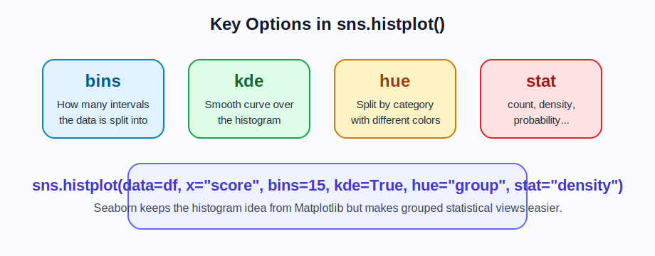
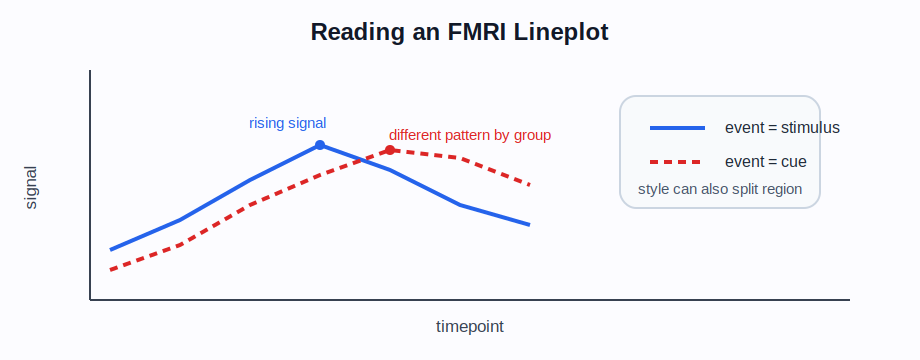

# Week 08 Note: Seaborn 입문과 `histplot`, `lineplot`, `scatterplot`

## 1. 이 주제의 목적

8주차의 목표는 `seaborn`이 무엇인지 이해하고, `matplotlib`에서 배운 히스토그램을 더 분석 친화적인 방식으로 확장하는 것입니다.

이번 주차에서는 특히 아래를 익히는 데 집중합니다.

- `NumPy`, `Pandas`, `matplotlib`, `seaborn` 모듈 호출 구조
- `seaborn`이 왜 필요한가
- `fmri` 같은 연습용 데이터셋을 불러와 분석하는 흐름
- `sns.histplot()`이 `plt.hist()`와 어떻게 다른가
- `sns.lineplot()`으로 시간 흐름 데이터를 읽는 방법
- 산점도(scatterplot)가 무엇이고 어떤 관계를 보여 주는가
- `sns.scatterplot()`으로 두 수치형 변수의 관계를 읽는 방법
- `DataFrame`을 바로 넣어 시각화하는 흐름
- `hue`, `style`, `size`, `kde`, `stat` 같은 통계 시각화 옵션이 왜 중요한가

즉, 8주차는 "그냥 그래프를 그리는 단계"에서 한 걸음 더 나아가 "데이터 분석용 시각화"로 넘어가는 출발점입니다.

## 2. 왜 중요한가

`matplotlib`는 강력하지만, 초심자 입장에서는 기본 설정을 많이 만져야 할 때가 있습니다.

반면 `seaborn`은
- 더 보기 좋은 기본 스타일을 제공하고
- `Pandas DataFrame`과 잘 연결되며
- 통계 그래프를 더 쉽게 그릴 수 있습니다

특히 데이터를 그룹별로 비교하거나 분포를 자연스럽게 표현할 때 `seaborn`이 유리합니다.

쉽게 말하면
- `matplotlib`: 범용 그래프 도구
- `seaborn`: 통계적 데이터 시각화에 더 친화적인 도구

입니다.

## 3. 선수 개념

이번 주차 전에 아래를 이해하고 있으면 좋습니다.

- `NumPy` 배열과 난수 생성
- `Pandas DataFrame`
- `matplotlib`의 `figure`, `axes`, `plot`, `hist`
- 7주차에서 배운 `bins`, `density`, `alpha`

연결 포인트
- 난수와 배열 기초: [../week03/Week03_Note.md](../week03/Week03_Note.md)
- `matplotlib` 기초와 `Pandas` 연결: [../week06/Week06_Note.md](../week06/Week06_Note.md)
- 히스토그램 기초: [../week07/Week07_Note.md](../week07/Week07_Note.md)
- 실습 코드: [../../week08_Seaborn_Intro.ipynb](../../week08_Seaborn_Intro.ipynb)

## 4. 핵심 개념과 용어 해설

### 4-1. `seaborn`은 무엇인가

`seaborn`은 `matplotlib` 위에서 동작하는 통계 시각화 라이브러리입니다.

> **참고 시각 자료: seaborn의 위치**
> 

이 말을 이해할 때 떠올려야 할 것
- 내부적으로는 `matplotlib`를 활용합니다
- 하지만 더 좋은 기본 스타일과 더 편한 문법을 제공합니다
- 특히 `DataFrame` 열 이름 기반 시각화가 편리합니다

### 4-2. 기본 모듈 호출과 테마 설정

```python
import numpy as np
import pandas as pd
import seaborn as sns
import matplotlib.pyplot as plt

sns.set_theme(style="whitegrid")
```

의미
- `numpy`: 수치 계산과 배열 생성
- `pandas`: 표 형태 데이터 처리
- `sns`: `seaborn`을 보통 이렇게 줄여 씁니다
- `plt`: `matplotlib`의 기본 시각화 인터페이스입니다
- `set_theme()`: 그래프 전체 스타일을 설정합니다

왜 필요한가
- 시각화 수업에서는 그래프 내용도 중요하지만, 읽기 쉬운 형태로 정리하는 것도 중요하기 때문입니다.

이 코드를 보면 바로 떠올려야 할 것
- `NumPy`로 숫자를 만들고
- `Pandas`로 표를 다루고
- `matplotlib`가 화면과 축을 만들고
- `seaborn`이 통계 시각화를 더 쉽게 그려 준다

### 4-3. `fmri` 데이터셋 사용

`seaborn`은 연습용 데이터셋으로 `fmri`를 자주 사용합니다. 이 데이터는 시간에 따라 뇌 신호(`signal`)가 어떻게 변하는지 담고 있어서 `lineplot` 예제에 매우 적합합니다.

이 프로젝트에서는 실행 재현성을 위해 같은 `fmri` 데이터를 로컬 CSV로 함께 둡니다.

```python
fmri = pd.read_csv("StudyNote/week08/data/fmri.csv")
fmri.head()
```

주요 열
- `subject`: 실험 대상 구분
- `timepoint`: 시간 축
- `event`: 자극 종류
- `region`: 뇌 영역
- `signal`: 측정된 신호 값

왜 중요한가
- 단순 난수 데이터보다, 시간 흐름과 그룹 비교가 함께 있는 실제 형태의 표를 연습할 수 있기 때문입니다.
- 이후 `lineplot`, `hue`, `style`을 설명하기 좋습니다.

### 4-4. `sns.histplot()`

7주차에서 `plt.hist()`를 배웠다면, 8주차에서는 `sns.histplot()`이 자연스럽게 이어집니다.

```python
sns.histplot(data=df_score, x="score", bins=15)
plt.show()
```

이 코드가 의미하는 것
- `data=df_score`: 사용할 `DataFrame`
- `x="score"`: x축으로 사용할 열 이름
- `bins=15`: 구간 수

왜 필요한가
- 실제 분석에서는 배열 하나보다 `DataFrame` 전체를 다루는 경우가 많기 때문입니다.
- 열 이름으로 바로 지정하는 방식이 더 읽기 쉽고 실수가 적습니다.

### 4-5. `histplot()`에서 자주 보는 옵션

#### `bins`

```python
sns.histplot(data=df_score, x="score", bins=20)
```

역할
- 구간 개수를 조절합니다.

#### `kde=True`

```python
sns.histplot(data=df_score, x="score", bins=20, kde=True)
```

역할
- 히스토그램 위에 부드러운 분포 곡선을 같이 보여 줍니다.

왜 필요한가
- 막대만 볼 때보다 분포의 전체 흐름을 더 부드럽게 읽을 수 있기 때문입니다.

#### `hue`

```python
sns.histplot(data=df_score, x="score", hue="group", bins=15)
```

역할
- 그룹별로 색을 나눠 같은 그래프에서 비교합니다.

왜 중요한가
- 두 집단 이상을 비교하는 순간부터 `seaborn`의 장점이 크게 드러납니다.

#### `stat`

```python
sns.histplot(data=df_score, x="score", stat="density")
```

역할
- y축 기준을 개수 대신 밀도로 바꿉니다.

기억할 것
- `stat="count"`: 개수 중심
- `stat="density"`: 정규화된 분포 중심

> **참고 시각 자료: `histplot`에서 생각해야 할 옵션**
> 

### 4-6. `sns.lineplot()`과 시간 흐름 데이터

히스토그램이 분포를 보는 도구라면, `lineplot`은 시간이나 순서에 따른 변화를 보는 도구입니다.

`fmri` 데이터셋에서는 아래처럼 자주 사용합니다.

```python
sns.lineplot(data=fmri, x="timepoint", y="signal")
plt.show()
```

이 코드는 `timepoint`가 증가할수록 `signal`이 어떻게 변하는지 보여 줍니다.

그룹 비교까지 하고 싶다면 아래처럼 확장합니다.

```python
sns.lineplot(
    data=fmri,
    x="timepoint",
    y="signal",
    hue="event",
    style="region"
)
plt.show()
```

이 코드가 의미하는 것
- `x="timepoint"`: 시간 축
- `y="signal"`: 측정값
- `hue="event"`: 자극 종류별 색상 구분
- `style="region"`: 영역별 선 스타일 구분

왜 필요한가
- 하나의 평균 추세만 보는 것이 아니라, 조건별 차이를 동시에 읽을 수 있기 때문입니다.

기억할 것
- `histplot`: 분포
- `lineplot`: 시간 흐름, 순서 변화, 추세

> **참고 시각 자료: `fmri`에서 `lineplot` 읽기**
> 

### 4-7. 산점도(scatterplot)란 무엇인가

산점도는 두 수치형 변수의 값을 각각 x축과 y축에 놓고, 각 관측값을 점 하나로 표현하는 그래프입니다.

쉽게 말하면
- 점 1개 = 데이터 1개
- x축 = 첫 번째 수치형 변수
- y축 = 두 번째 수치형 변수

입니다.

예를 들어 학생 데이터가 있을 때
- x축: 공부 시간
- y축: 시험 점수

로 두면, 공부 시간이 늘어날수록 점수가 올라가는 경향이 있는지 바로 볼 수 있습니다.

> **참고 시각 자료: 산점도의 기본 해석**
> 

산점도를 보면 무엇을 읽어야 하는가
- 양의 관계: x가 커질수록 y도 커지는가
- 음의 관계: x가 커질수록 y는 작아지는가
- 군집: 점들이 몇 개의 그룹으로 모이는가
- 이상치: 다른 점들과 멀리 떨어진 점이 있는가

왜 중요한가
- 분포는 `histplot`
- 시간 흐름은 `lineplot`
- 변수 사이 관계는 `scatterplot`

으로 보는 도구가 다르기 때문입니다.

### 4-8. `sns.scatterplot()`

가장 기본적인 문법은 아래입니다.

```python
sns.scatterplot(data=df_study, x="study_hours", y="score")
plt.show()
```

이 코드가 의미하는 것
- `data=df_study`: 사용할 표
- `x="study_hours"`: x축 변수
- `y="score"`: y축 변수

왜 필요한가
- 두 수치형 변수 사이의 관계를 시각적으로 확인할 수 있기 때문입니다.
- 상관관계가 있는지, 이상치가 있는지, 그룹 차이가 있는지 한 번에 보기 좋습니다.

#### `hue`

```python
sns.scatterplot(data=df_study, x="study_hours", y="score", hue="group")
```

역할
- 그룹별로 점 색을 다르게 합니다.

왜 필요한가
- 같은 관계라도 집단별 패턴이 다른지 볼 수 있기 때문입니다.

#### `style`

```python
sns.scatterplot(data=df_study, x="study_hours", y="score", hue="group", style="passed")
```

역할
- 점 모양을 다르게 합니다.

왜 필요한가
- 색만으로 구분하기 어려운 경우, 또 다른 범주 정보를 함께 표현할 수 있기 때문입니다.

#### `size`

```python
sns.scatterplot(data=df_study, x="study_hours", y="score", size="sleep_hours")
```

역할
- 세 번째 수치형 정보를 점 크기로 표현합니다.

왜 필요한가
- 2차원 평면에 추가 정보를 겹쳐 보여 줄 수 있기 때문입니다.

기억할 것
- `hue`: 색
- `style`: 점 모양
- `size`: 점 크기

### 4-9. `matplotlib`와의 관계

`seaborn`을 써도 `matplotlib`를 완전히 버리는 것은 아닙니다.

```python
fig, ax = plt.subplots(figsize=(7, 4))
sns.histplot(data=df_score, x="score", bins=15, kde=True, ax=ax)
ax.set_title("Score Distribution")
plt.show()
```

이 구조에서 떠올려야 할 것
- 실제 그리기는 `seaborn`
- 축 제목, 레이아웃, 저장 등 세부 제어는 여전히 `matplotlib`

즉, 두 라이브러리는 경쟁 관계라기보다 연결 관계에 가깝습니다.

### 4-10. `seaborn`에서 이어서 배우게 될 함수들

이번 주차는 `histplot`이 중심이지만, 이후 아래 함수들로 확장됩니다.

- `scatterplot()`: 두 수치형 변수의 관계
- `boxplot()`: 중앙값, 사분위수, 이상치
- `countplot()`: 범주형 데이터 개수 비교
- `lineplot()`: 추세 비교

각 함수를 보면 떠올려야 할 것
- `histplot`: 분포
- `scatterplot`: 관계
- `boxplot`: 요약 통계와 이상치
- `countplot`: 범주 빈도
- `lineplot`: 시간 흐름과 추세

### 4-11. 언제 `matplotlib`, 언제 `seaborn`을 쓰는가

간단 기준
- 세밀하게 직접 제어하고 싶으면 `matplotlib`
- 빠르게 보기 좋은 통계 그래프를 그리고 싶으면 `seaborn`

초심자 기준 실전 판단
- 분포 비교, 그룹 비교: `seaborn`
- 세부 축 배치, 복합 커스터마이징: `matplotlib`

## 5. 실습 파일과 핵심 흐름

관련 실습
- [../../week08_Seaborn_Intro.ipynb](../../week08_Seaborn_Intro.ipynb)

추천 실습 순서
1. `NumPy`, `Pandas`, `matplotlib`, `seaborn` 모듈 호출 구조 확인하기
2. `sns.set_theme()`로 기본 스타일 설정하기
3. `pd.read_csv("StudyNote/week08/data/fmri.csv")`로 `fmri` 데이터 불러오기
4. `sns.histplot()`의 가장 기본형 실행하기
5. `bins`, `kde=True`를 바꿔 보기
6. `hue`로 그룹별 비교하기
7. `stat="count"`와 `stat="density"` 차이 보기
8. `sns.lineplot()`으로 시간 흐름 읽기
9. `sns.scatterplot()`으로 변수 관계 읽기
10. `hue`, `style`, `size`를 바꿔 보기
11. `ax=`를 넣어 `matplotlib`와 함께 쓰기
12. `boxplot`, `countplot`을 미리 맛보기로 보기

실습 중 계속 확인할 질문
- 지금 보고 싶은 것은 분포인가, 관계인가, 범주 개수인가?
- 지금 보고 싶은 것이 분포인지, 시간에 따른 변화인지 먼저 구분했는가?
- 지금 보고 싶은 것이 "관계"라면 `scatterplot`이 맞는가?
- 단순 `matplotlib`보다 `seaborn`이 더 읽기 쉬운 이유는 무엇인가?
- `hue`와 `kde`가 그래프 해석을 어떻게 바꾸는가?

## 6. 자주 하는 실수

### 실수 1. `seaborn`을 `matplotlib`와 완전히 다른 것으로 생각함

올바른 방향
- `seaborn`은 `matplotlib` 위에서 동작합니다.
- 둘은 끊어지는 것이 아니라 이어집니다.

### 실수 2. `hue`를 쓰면서 범주형 열을 제대로 준비하지 않음

올바른 방향
- 그룹 비교를 하려면 그룹 열이 명확해야 합니다.
- `Pandas` 열 이름과 값 구성을 먼저 확인해야 합니다.

### 실수 3. `kde=True`를 넣은 곡선을 실제 데이터 개수와 혼동함

올바른 방향
- `kde`는 부드러운 분포 추정 곡선입니다.
- 개수 막대와 의미가 완전히 같지는 않습니다.

### 실수 4. `stat="density"`와 `count`를 구분하지 않음

올바른 방향
- y축이 무엇을 의미하는지 항상 먼저 확인해야 합니다.

### 실수 5. `seaborn` 그래프인데도 축 제어를 전혀 하지 않음

올바른 방향
- 필요하면 `fig, ax = plt.subplots()`와 `ax=`를 함께 써야 합니다.

### 실수 6. `lineplot`에서 시간 축과 범주 축을 혼동함

올바른 방향
- `lineplot`은 순서나 시간 흐름이 있는 데이터에 적합합니다.
- 단순 범주 비교라면 `barplot`이나 `countplot`이 더 맞을 수 있습니다.

### 실수 7. 산점도에서 x축이나 y축에 범주형 열을 무리하게 넣음

올바른 방향
- `scatterplot`은 기본적으로 두 수치형 변수의 관계를 볼 때 가장 적합합니다.
- 범주 비교가 목적이면 `countplot`, `boxplot`, `barplot`이 더 맞을 수 있습니다.

### 실수 8. 점 하나가 무엇을 뜻하는지 생각하지 않음

올바른 방향
- 산점도에서 점 1개는 관측값 1개입니다.
- 점 하나하나가 어떤 행(row)을 의미하는지 생각해야 해석이 정확해집니다.

## 7. 시험 대비 포인트

시험 직전에는 아래를 설명할 수 있어야 합니다.

- `seaborn`이 무엇인가
- 왜 `NumPy`, `Pandas`, `matplotlib`, `seaborn`을 함께 호출하는가
- `fmri` 데이터셋은 어떤 예제에 적합한가
- `matplotlib`와 어떤 관계인가
- `sns.histplot()` 기본 문법
- `sns.lineplot()` 기본 문법
- 산점도(scatterplot)가 무엇인가
- `sns.scatterplot()` 기본 문법
- `bins`, `kde`, `hue`, `style`, `size`, `stat` 의미
- `histplot`과 `plt.hist()` 차이
- `lineplot`과 `scatterplot` 차이
- 왜 `DataFrame` 기반 시각화에서 `seaborn`이 편한가

서술형 답안 구조 예시

> `seaborn`은 `matplotlib` 기반의 통계 시각화 라이브러리이다. 보통 `NumPy`, `Pandas`, `matplotlib`와 함께 사용하며, 기본 스타일이 보기 좋고 `DataFrame`과 잘 연결된다. 히스토그램은 `sns.histplot()`으로 그리고, 시간 흐름 데이터는 `sns.lineplot()`으로 표현할 수 있다. 두 수치형 변수의 관계를 볼 때는 `sns.scatterplot()`을 사용하며, 점 하나는 관측값 하나를 뜻한다. 또한 `hue`, `style`, `size`를 이용하면 집단, 상태, 추가 수치 정보를 함께 표현할 수 있다.

## 8. 기존 문서와 연결 포인트

- 배열과 난수: [../week03/Week03_Note.md](../week03/Week03_Note.md)
- `matplotlib` 기초: [../week06/Week06_Note.md](../week06/Week06_Note.md)
- 히스토그램 기초: [../week07/Week07_Note.md](../week07/Week07_Note.md)
- 실습 코드: [../../week08_Seaborn_Intro.ipynb](../../week08_Seaborn_Intro.ipynb)

## 9. 빠른 요약

- `seaborn`은 `matplotlib` 위에서 동작하는 통계 시각화 라이브러리입니다.
- 보통 `NumPy`, `Pandas`, `matplotlib`, `seaborn`을 함께 호출합니다.
- `fmri` 같은 연습용 데이터셋으로 바로 실습할 수 있습니다.
- 8주차의 시작 함수는 `sns.histplot()`, `sns.lineplot()`, `sns.scatterplot()`입니다.
- 산점도는 두 수치형 변수의 관계를 읽는 그래프입니다.
- `bins`, `kde`, `hue`, `style`, `size`, `stat`가 핵심 옵션입니다.
- `DataFrame`을 직접 넣는 흐름이 자연스럽다는 점이 큰 장점입니다.
- `matplotlib`와 끊어지지 않고 함께 사용된다는 점을 기억해야 합니다.
