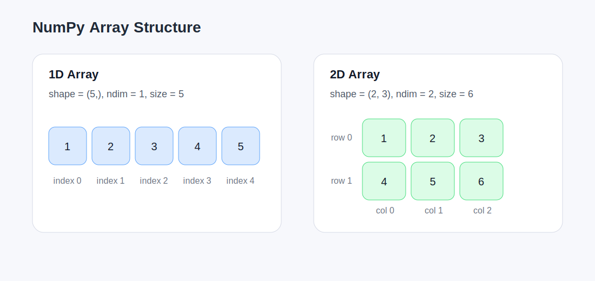
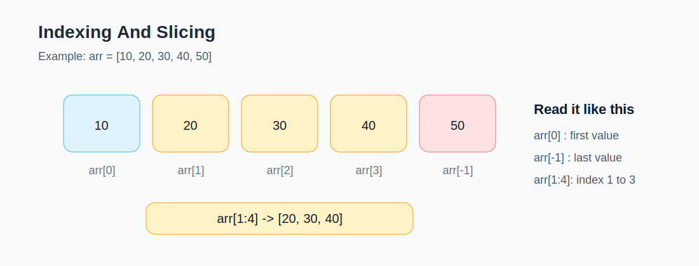
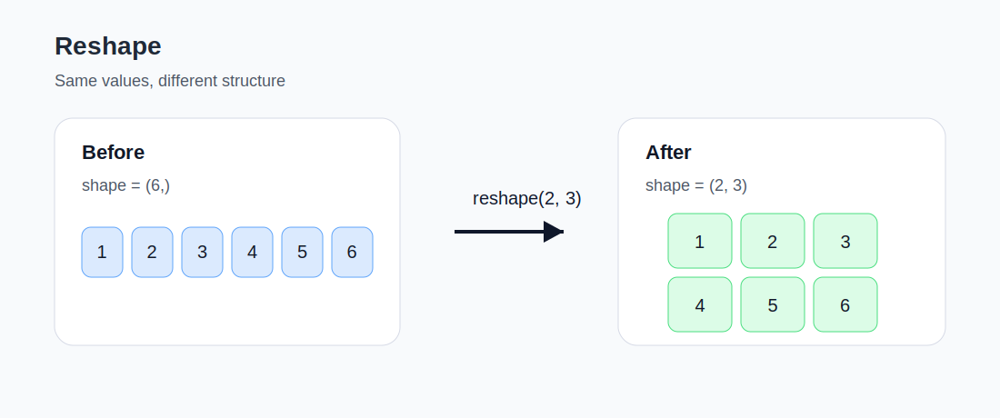

# NumPy Visual Study Notes

`NumPy` is easier to learn when the array structure is visible.
This document explains the very basics used in [../week03_NumPy.ipynb](../week03_NumPy.ipynb) with simple diagrams.

## 1. 1D Array And 2D Array

The key point is that a NumPy array has a shape and a number of dimensions.



What to notice:
- `shape=(5,)` means one row of 5 values
- `shape=(2, 3)` means 2 rows and 3 columns
- `ndim` is the number of dimensions
- `size` is the total number of elements

Example:

```python
import numpy as np

arr = np.array([1, 2, 3, 4, 5])
arr2 = np.array([[1, 2, 3], [4, 5, 6]])

print(arr.shape)   # (5,)
print(arr2.shape)  # (2, 3)
print(arr2.ndim)   # 2
```

## 2. Indexing And Slicing

You can access one value or a range of values with indexing and slicing.



Example:

```python
import numpy as np

arr = np.array([10, 20, 30, 40, 50])

print(arr[0])    # 10
print(arr[2])    # 30
print(arr[-1])   # 50
print(arr[1:4])  # [20 30 40]
```

## 3. Reshape

`reshape()` changes the structure of the array without changing the values.



Example:

```python
import numpy as np

arr = np.array([1, 2, 3, 4, 5, 6])
arr2 = arr.reshape(2, 3)

print(arr.shape)   # (6,)
print(arr2.shape)  # (2, 3)
print(arr2)
```

## 4. Basic Functions

For basic practice, these functions are enough:

```python
import numpy as np

arr = np.array([1, 2, 3, 4, 5])

print(np.sum(arr))   # 15
print(np.mean(arr))  # 3.0
print(np.max(arr))   # 5
print(np.min(arr))   # 1
```

## 5. How To Study

Recommended order:
1. Open [../week03_NumPy.ipynb](../week03_NumPy.ipynb)
2. Read one section in this document
3. Run the matching notebook cell
4. Change the numbers and check how `shape` and outputs change
